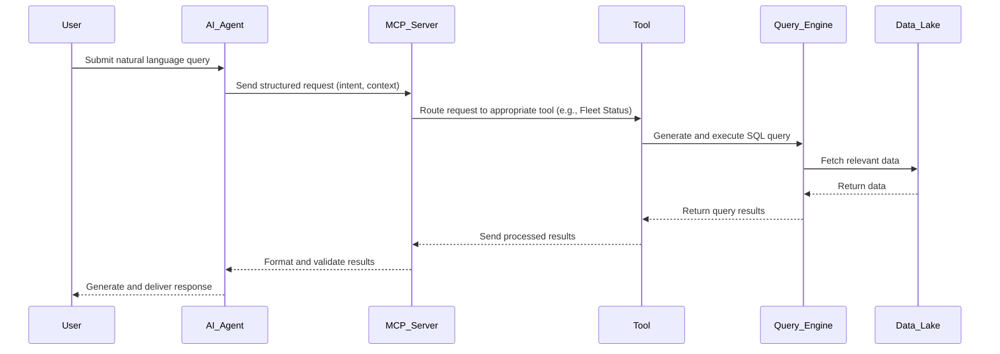

# Agentic Device Fleet Monitoring System - Architecture

## System Architecture Overview

The system is designed as a modern, event-driven architecture that separates concerns between data ingestion, storage, query processing, and AI-powered analysis.

## Architecture Diagram

```
┌─────────────────┐    ┌──────────────┐    ┌─────────────────┐
│   Connected     │    │   Heartbeat  │    │     Kafka       │
│    Devices      │──▶│   Service    │──▶│   Message       │
│                 │    │   (MSSQL)    │    │   Broker        │
└─────────────────┘    └──────────────┘    └─────────────────┘
                                                     │
                                                     ▼
┌─────────────────┐    ┌──────────────┐    ┌─────────────────┐
│     User        │    │  AI Agent    │    │ Data Pipeline   │
│   Interface     │◀──│    System    │    │  (Streaming)    │
│                 │    │              │    │                 │
└─────────────────┘    └──────────────┘    └─────────────────┘
                              │                       │
                              ▼                       ▼
                    ┌──────────────┐    ┌─────────────────┐
                    │ MCP Server   │    │  Data Lake      │
                    │ (Context)    │    │  (Bucket)       │
                    └──────────────┘    └─────────────────┘
                              │                       │
                              └───────────┬───────────┘
                                          ▼
                                ┌─────────────────┐
                                │  Trino Query    │
                                │     Engine      │
                                └─────────────────┘
```

## Component Architecture

### 1. AI Agent System
**Responsibility**: Central intelligence and orchestration

**Components**:
- **Natural Language Processor**: Understands user queries and intent
- **Query Planner**: Determines execution strategy for user requests
- **Response Generator**: Synthesizes results into human-readable responses
- **Context Manager**: Maintains conversation state and history

**Technology**: Large Language Model (GPT-4, Claude, or similar)

### 2. MCP (Model Context Protocol) Server
**Responsibility**: Structured interface between AI and data systems

**Components**:
- **Schema Provider**: Exposes data structure and available operations
- **Query Translator**: Converts AI requests to SQL queries
- **Result Formatter**: Structures query results for AI consumption
- **Validation Layer**: Ensures query safety and permissions

**Why MCP**: Provides standardized, type-safe communication between AI and tools

### MCP Server Interaction Diagram



**Key Steps**:
- AI Agent translates user intent and context for MCP Server.
- MCP Server validates, translates, and routes requests to domain tools.
- Tools interact with the query engine for data retrieval.
- Results are formatted and validated before returning to the AI Agent.
- AI Agent synthesizes a user-friendly response.

### 3. Tools Layer
**Responsibility**: Specialized functionality for data operations

**Tool Categories**:
- **Fleet Status Tool**: Real-time device health queries
- **Trend Analysis Tool**: Historical pattern analysis
- **Alert Tool**: Device failure notifications and predictions
- **Reporting Tool**: Generate structured reports and visualizations

### 4. Data Pipeline
**Responsibility**: Event processing and data storage

**Components**:
- **Kafka Consumer**: Processes device status change events
- **Data Serializer**: Converts events to optimized storage format (Parquet/Delta)
- **Bucket Manager**: Organizes data for efficient querying
- **Data Catalog**: Maintains metadata and schema information

### 5. Query Engine (Trino)
**Responsibility**: SQL execution and data access

**Features**:
- **Distributed Processing**: Scales to handle large datasets
- **Multiple Connectors**: Access various data sources
- **Query Optimization**: Efficient execution planning
- **Caching**: Improves response times for frequent queries

## Interaction Patterns

### 1. Real-time Query Flow
```
User Question → AI Agent → MCP Server → Fleet Status Tool → Trino → Data Lake → Results → AI Analysis → Response
```

### 2. Trend Analysis Flow
```
User Question → AI Agent → MCP Server → Trend Analysis Tool → Trino → Historical Data → ML Analysis → Insights
```

### 3. Event Processing Flow
```
Device Status Change → Kafka Event → Data Pipeline → Bucket Storage → Schema Update → Catalog Refresh
```

## Data Model

### Device Status Events
```json
{
  "device_id": "string",
  "timestamp": "datetime",
  "status": "active|inactive|dead",
  "previous_status": "active|inactive|dead",
  "location": "string",
  "device_type": "string",
  "metadata": {
    "last_heartbeat": "datetime",
    "signal_strength": "number",
    "battery_level": "number"
  }
}
```

### Aggregated Metrics
```sql
-- Partitioned by date for efficient querying
CREATE TABLE device_status_daily (
  date DATE,
  device_id STRING,
  status STRING,
  uptime_percentage DOUBLE,
  failure_count INT,
  location STRING,
  device_type STRING
) PARTITIONED BY (date);
```

## Responsibility Boundaries

### AI Agent Responsibilities
- Natural language understanding
- Query intent classification
- Response generation and formatting
- Conversation context management
- High-level reasoning and analysis

### MCP Server Responsibilities
- Protocol compliance and type safety
- Query validation and security
- Result structure standardization
- Tool capability discovery
- Error handling and recovery

### Tools Responsibilities
- Domain-specific operations
- Data retrieval optimization
- Business logic implementation
- Result caching and performance
- Specialized analysis algorithms

## Security Considerations

- **Query Validation**: SQL injection prevention
- **Access Control**: Role-based data access
- **Data Privacy**: Sensitive information handling
- **Audit Logging**: Query and access tracking
- **Rate Limiting**: Prevent resource exhaustion

## Scalability Design

- **Horizontal Scaling**: Trino cluster expansion
- **Data Partitioning**: Time-based and location-based partitions
- **Caching Strategy**: Multi-level result caching
- **Load Balancing**: Distribute AI agent requests
- **Resource Management**: Auto-scaling based on demand

## Integration Points

### Existing Systems
- **MSSQL Database**: Read-only access for real-time data
- **Kafka Infrastructure**: Subscribe to device status events
- **Monitoring Systems**: Health checks and alerting

### External Services
- **LLM Provider**: AI model API access
- **Storage Services**: Cloud bucket storage
- **Authentication**: SSO integration
- **Notification Services**: Alert delivery
