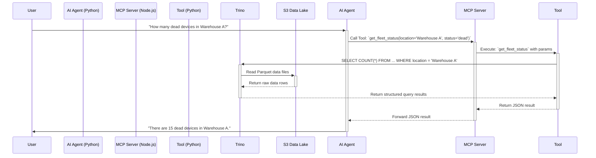
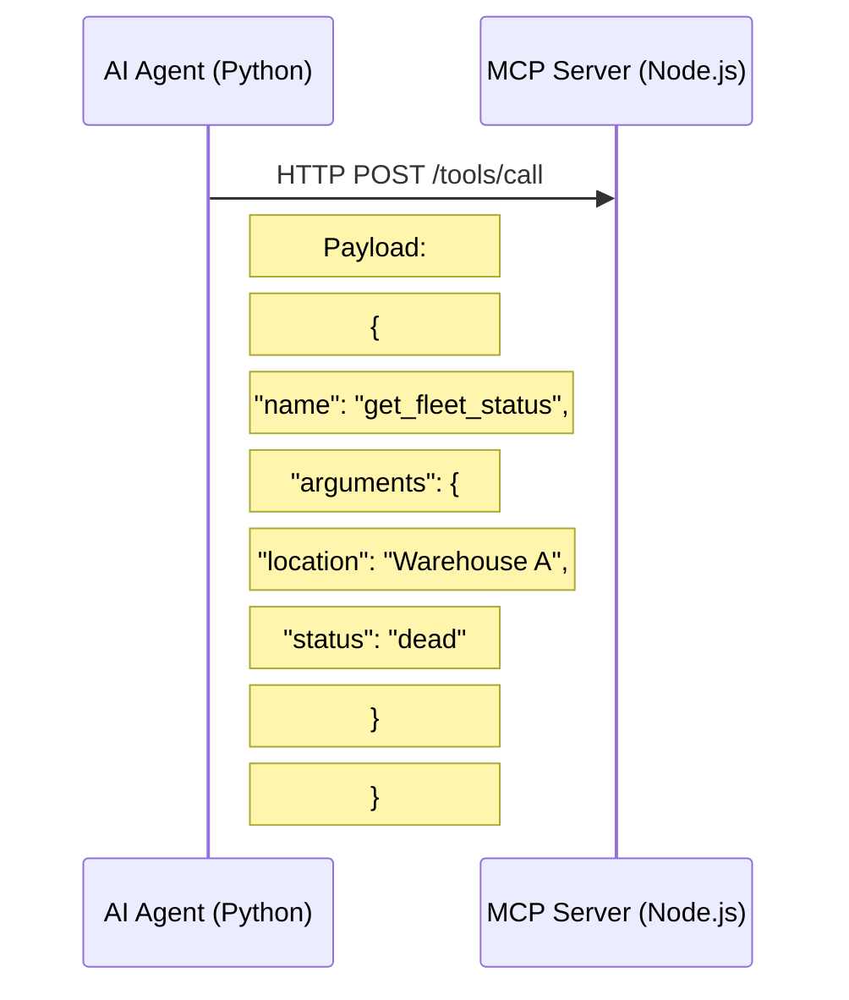
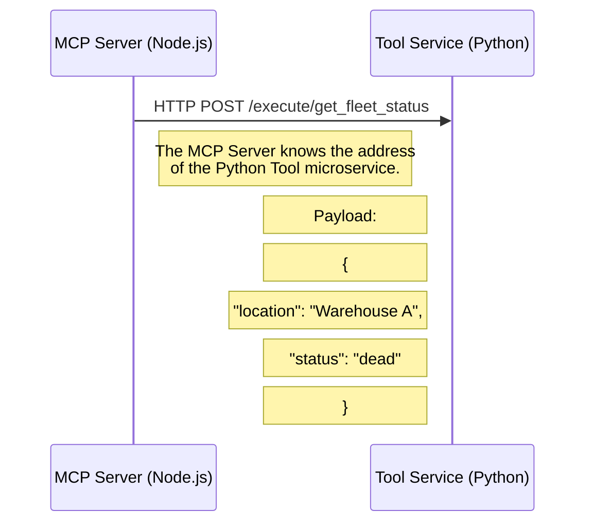
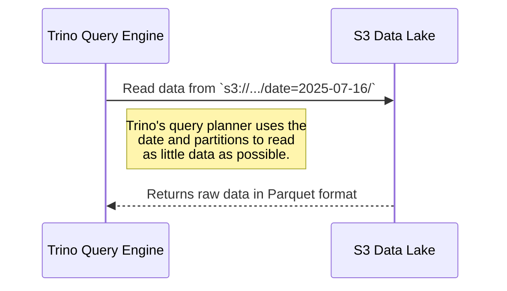
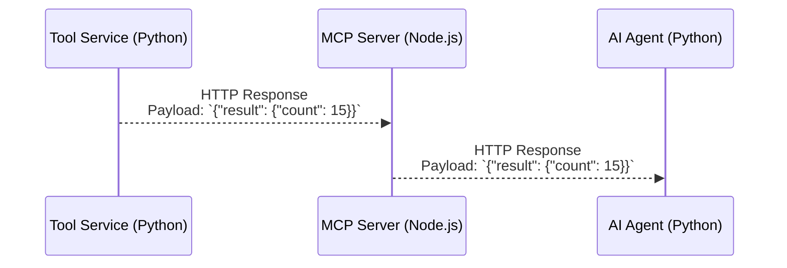

# System Flow Fragments: A Visual Journey

This document breaks down the entire query lifecycle into a series of detailed visual fragments. Each fragment represents a key step in the process, showing how components interact in a "comics-like" format.

## Overview: The Entire Journey

First, let's look at the complete, high-level flow from user question to final answer. This is the map for our journey.



---

## Fragment 1: The User Asks

A user has a question. They send it as a simple string to the AI Agent's API endpoint. This is the spark that ignites the entire process.

```mermaid
graph TD
    subgraph "User's Browser/CLI"
        U[<font size=6>👨‍💻</font><br>User] --> Q{POST /query API Call};
    end

    subgraph "AI Agent Service (Python/Flask)"
        Q -->|HTTP Request| E[API Endpoint];
        E -->|Payload: `{"query": "..."}`| P[Query Processor];
    end

    style U fill:#dff,stroke:#333,stroke-width:2px;
    style Q fill:#cff,stroke:#333,stroke-width:2px;
```

---

## Fragment 2: The Agent Thinks

The AI Agent receives the query. It doesn't just look for keywords; it uses a Large Language Model (LLM) to understand the user's *intent* and extract key pieces of information, called parameters.

```mermaid
graph TD
    subgraph "AI Agent Core Logic"
        direction LR
        A[User Query: "How many dead devices in Warehouse A?"] --> B{LLM Intent Analysis};
        B -->|Identifies| C(Intent: `fleet_status`);
        B -->|Extracts| D(Parameter: `location: 'Warehouse A'`);
        B -->|Extracts| E(Parameter: `status: 'dead'`);
        C --> F[Tool Selection Logic];
        D --> F;
        E --> F;
        F --> G[Selected Tool: `get_fleet_status`];
    end

    style A fill:#cff,stroke:#333,stroke-width:2px;
    style B fill:#f9f,stroke:#333,stroke-width:2px;
    style G fill:#9f9,stroke:#333,stroke-width:2px;
```

---

## Fragment 3: The Call to the Bridge

Now knowing *what* to do, the AI Agent makes a structured, secure call to the MCP Server. It's not sending raw SQL; it's calling a well-defined tool from the server's list of capabilities.



---

## Fragment 4: The Bridge to the Workshop

The MCP Server acts as a secure gateway. It validates the incoming request and then makes a *different* network call to the actual Python service where the tool's code lives. This decouples the AI from the implementation.



---

## Fragment 5: The Tool Gets to Work

The Python Tool receives the request. This is where the magic of data retrieval happens. The tool's code is responsible for constructing the precise, safe SQL query needed to get the answer from Trino.

```mermaid
graph TD
    subgraph "Tool Service (Python)"
        A[Request Received<br>`{location: 'Warehouse A', ...}`] --> B{`get_fleet_status` function};
        B --> C{SQL Generation Logic};
        C --> D["SQL:<br>`SELECT COUNT(*) ...` <br>`WHERE location = 'Warehouse A' ...`"];
        D --> E{Trino Client};
        E --> F[Execute Query];
    end

    style D fill:#fcf,stroke:#333,stroke-width:2px;
    style F fill:#9f9,stroke:#333,stroke-width:2px;
```

---

## Fragment 6: The Journey for Data

The tool sends the SQL query to the Trino engine. Trino is the expert librarian. It parses the query, figures out the fastest way to get the data, and goes directly to the right "aisles" (partitions) in the S3 Data Lake.



---

## Fragment 7: The Answer Returns

Data flows back up the chain. Trino sends structured results to the Tool. The Tool packages this into a clean JSON object. The MCP Server simply passes this structured answer back to the AI Agent who originally asked.



---

## Fragment 8: The Final Synthesis

The AI Agent now has the structured data it needs: `{"count": 15}`. This isn't a good answer for a human. The Agent performs its final and most important task: it synthesizes the data into a helpful, natural language response.

```mermaid
graph TD
    subgraph "AI Agent Final Response Generation"
        A[Tool Result: `{"count": 15}`] --> B{LLM Synthesis};
        C[Original Query: "How many dead devices in Warehouse A?"] --> B;
        B --> D["Final Answer:<br>'Currently, there are 15 dead devices in Warehouse A.'"];
    end

    style A fill:#9f9,stroke:#333,stroke-width:2px;
    style B fill:#f9f,stroke:#333,stroke-width:2px;
    style D fill:#dff,stroke:#333,stroke-width:2px;
```
