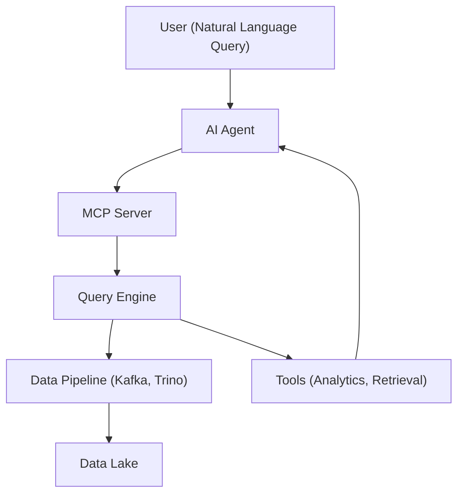

# Agentic Device Fleet Monitoring System

An intelligent agent-based system for monitoring and analyzing device fleet health using AI-powered natural language queries.

## Overview

This system enables users to query device fleet status and trends using natural language, automatically translating queries into SQL, executing them against a data lake, and providing intelligent analysis of results.

## Key Features

- **Natural Language Querying**: Ask questions about device fleet health in plain English
- **Intelligent Analysis**: AI-powered insights and trend analysis
- **Real-time Monitoring**: Live device status tracking via Kafka streams
- **Historical Analytics**: Query historical trends and patterns
- **Scalable Architecture**: Built on modern data lake and streaming technologies

## Architecture Components

1. **AI Agent**: Central intelligence layer for query understanding and response generation
2. **MCP Server**: Model Context Protocol server for structured data access
3. **Query Engine**: SQL generation and execution management
4. **Data Pipeline**: Kafka-based streaming and Trino analytics
5. **Tools**: Specialized components for data retrieval and analysis

## High-Level Architecture Diagram

## Quick Start

See [Implementation Guide](docs/implementation-guide.md) for detailed setup instructions.

## Documentation

- [Architecture Overview](ARCHITECTURE.md)
- [Project Overview](PROJECT_OVERVIEW.md)
- [Implementation Guide](docs/implementation-guide.md)
- [API Reference](docs/api-reference.md)
- [Deployment Guide](docs/deployment-guide.md)
