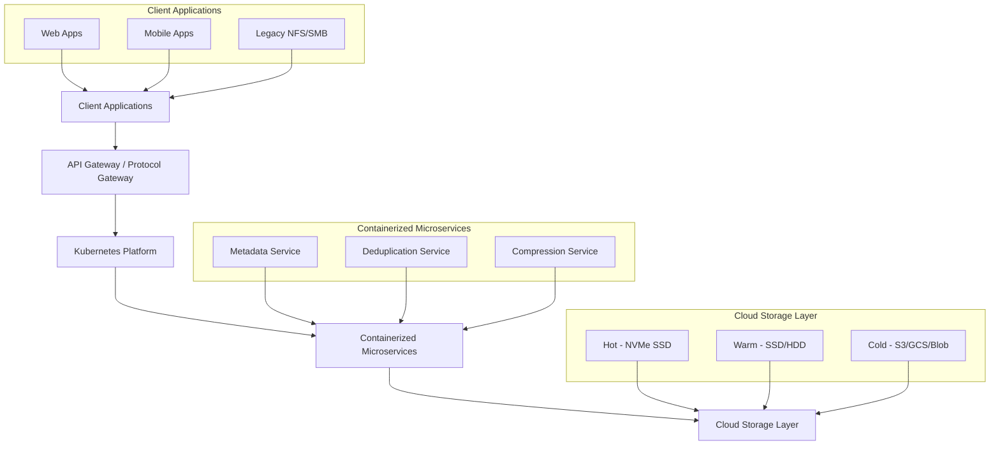
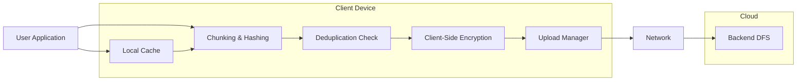
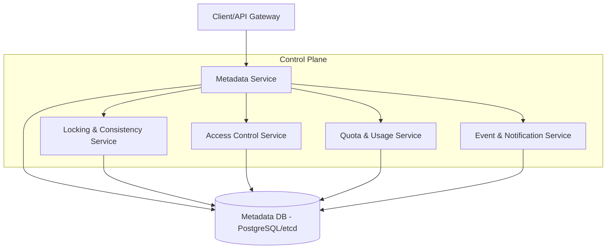

# Distributed File System (DFS)

A **cloud-native, storage-optimized** distributed file system designed to serve millions of concurrent users with exceptional storage efficiency and high availability.

## 🚀 Overview

This distributed file system is built as a **modern, containerized platform** with storage optimization as its cornerstone. It delivers enterprise-grade performance while achieving significant storage savings through advanced deduplication, compression, and erasure coding techniques.

## 🖼️ High-Level System Diagram



### 🗄️ Client Storage Level (Data plane)

The **client storage level** acts as the first layer of the DFS, providing local caching, pre-upload deduplication, and encryption before data is sent to the backend. This layer optimizes bandwidth, reduces latency, and enhances security by processing data as close to the user as possible.

#### How It Works

1. **Local Cache**: Frequently accessed files and metadata are cached on the client device for instant access and offline availability.
2. **Pre-Upload Deduplication**: The client computes content hashes and checks with the backend to avoid uploading duplicate data chunks.
3. **Client-Side Encryption**: Data is encrypted on the client before transmission, ensuring zero-knowledge security.
4. **Upload Pipeline**: Data is chunked, deduplicated, encrypted, and then uploaded in parallel streams for maximum throughput.
5. **Resumable Uploads**: Interrupted uploads can resume from the last successful chunk, improving reliability on unstable networks.

#### Client Storage Level Diagram



### 🗃️ Metadata Database & Control Plane

The **metadata database** is the backbone of the DFS control plane, orchestrating file system operations, access control, consistency, and coordination across all nodes and services.

#### Key Metadata Services

- **Metadata Service**: Manages file/directory hierarchy, attributes, permissions, and versioning.
- **Locking & Consistency Service**: Ensures strong consistency and atomic operations using distributed locks and transactions.
- **Access Control Service**: Enforces RBAC, ACLs, and audit logging for all metadata operations.
- **Quota & Usage Service**: Tracks storage usage, enforces quotas, and provides real-time analytics.
- **Event & Notification Service**: Publishes change events for replication, indexing, and external integrations.

#### Metadata Control Plane Diagram



**Highlights:**
- **Strong Consistency**: All metadata changes are transactional and ACID-compliant.
- **High Availability**: Metadata DB is replicated and uses consensus protocols (e.g., etcd Raft, PostgreSQL Patroni).
- **Scalability**: Sharding and partitioning for horizontal scale.
- **Observability**: All metadata operations are traced and logged for audit and debugging.


**Benefits:**  
- Reduces redundant uploads and bandwidth usage  
- Enables offline access and faster file operations  
- Enhances privacy with end-to-end encryption  
- Improves upload reliability and user experience  

### Key Features

- **🔧 Storage Efficiency**: 5x+ storage savings through global deduplication and adaptive compression
- **☁️ Cloud-Native**: Kubernetes-based deployment with auto-scaling and multi-cloud support
- **⚡ High Performance**: 100GB/s+ aggregate throughput with sub-100ms latency
- **🌐 Massive Scale**: Support for millions of concurrent users across global deployments
- **🛡️ High Availability**: 99.99% uptime with automatic failover and disaster recovery
- **🔒 Enterprise Security**: End-to-end encryption, RBAC, audit logging, and compliance ready
- **📊 Read-After-Write Consistency**: Ensures clients always see their own writes immediately
- **🔄 Protocol Support**: Native REST/gRPC APIs plus NFS/SMB gateway for legacy compatibility

## 📁 Architecture

```
┌─────────────────────────────────────────────────────────────────┐
│                        Client Applications                      │
├─────────────────┬─────────────────┬─────────────────────────────┤
│   Web Apps      │   Mobile Apps   │     Legacy NFS/SMB          │
└─────────────────┴─────────────────┴─────────────────────────────┘
                                │
┌─────────────────────────────────────────────────────────────────┐
│                   Kubernetes Platform                           │
├─────────────────┬─────────────────┬─────────────────────────────┤
│  API Gateway    │  Protocol GW    │   Service Mesh              │
│  (Envoy)        │  (NFS/SMB)      │   (Istio)                   │
└─────────────────┴─────────────────┴─────────────────────────────┘
                                │
┌─────────────────────────────────────────────────────────────────┐
│                    Containerized Microservices                  │
├─────────────────┬─────────────────┬─────────────────────────────┤
│ Metadata Pods   │ Dedup Pods      │   Compression Pods          │
│ (StatefulSet)   │ (Deployment)    │   (Deployment)              │
└─────────────────┴─────────────────┴─────────────────────────────┘
                                │
┌─────────────────────────────────────────────────────────────────┐
│                     Cloud Storage Layer                         │
├─────────────────┬─────────────────┬─────────────────────────────┤
│  Hot (NVMe SSD) │ Warm (SSD/HDD)  │   Cold (S3/GCS/Blob)        │
│  StatefulSets   │ Persistent Vols │   Object Storage            │
└─────────────────┴─────────────────┴─────────────────────────────┘
```

## ☁️ Deployment Options

### Recommended: Managed Kubernetes
- **AWS**: EKS with i4i instances + S3 integration
- **Google Cloud**: GKE with n2-highmem + GCS integration  
- **Azure**: AKS with L-series VMs + Blob Storage integration
- **Multi-Cloud**: Deploy across multiple providers for redundancy

### Enterprise Options
- **Hybrid Cloud**: On-premises Kubernetes + cloud storage tiers
- **Private Cloud**: OpenShift, Rancher, or VMware Tanzu
- **Edge Deployment**: K3s for distributed edge storage

### Quick Start
```bash
# Deploy on AWS EKS
helm repo add dfs-charts https://charts.dfs.example.com
helm install dfs dfs-charts/distributed-file-system \
  --set cloud.provider=aws \
  --set storage.hot.instanceType=i4i.4xlarge \
  --set storage.cold.s3Bucket=my-dfs-bucket

# Deploy on Google GKE  
helm install dfs dfs-charts/distributed-file-system \
  --set cloud.provider=gcp \
  --set storage.hot.instanceType=n2-highmem-16 \
  --set storage.cold.gcsBucket=my-dfs-bucket
```

## 📋 Documentation

### Core Documentation
- [Project Overview](PROJECT_OVERVIEW.md) - High-level system overview and design principles
- [Architecture](ARCHITECTURE.md) - Detailed system architecture and component design
- [Deployment Strategy](docs/deployment-strategy.md) - **NEW**: Modern cloud-native deployment guide
- [Storage Optimization](docs/storage-optimization.md) - Deep dive into storage efficiency strategies

### Implementation Guides
- [Implementation Guide](docs/implementation-guide.md) - Step-by-step development roadmap
- [API Reference](docs/api-reference.md) - Complete REST and gRPC API documentation
- [Performance Analysis](docs/performance-analysis.md) - Performance targets and optimization strategies
- [Security Operations](docs/security-operations.md) - Comprehensive security framework
- [OpenTelemetry Observability](docs/opentelemetry-observability.md) - Distributed tracing and metrics

## 🎯 Performance Targets

| Metric | Target | Peak Capacity |
|--------|--------|---------------|
| **Concurrent Users** | 1M+ | 2M+ |
| **Read Throughput** | 100 GB/s | 150 GB/s |
| **Write Throughput** | 50 GB/s | 75 GB/s |
| **Metadata Operations** | 1M ops/s | 1.5M ops/s |
| **P99 Read Latency** | < 100ms | < 50ms |
| **Storage Efficiency** | 5x+ savings | 7x+ savings |
| **Uptime** | 99.99% | 99.999% |

## 💾 Storage Optimization

### Multi-Layer Optimization Strategy

#### 1. Global Deduplication (70% space savings)
- Content-defined chunking with Rabin fingerprinting
- Variable chunk sizes (32KB-128KB) for optimal boundaries
- Global deduplication index with consistent hashing
- Bloom filters for fast negative lookups

#### 2. Adaptive Compression (60% additional savings)
- **Hot Data**: LZ4 for fast access (2.5x compression)
- **Warm Data**: ZSTD for balanced performance (3.5x compression)
- **Cold Data**: LZMA2 for maximum efficiency (5x compression)
- ML-based algorithm selection for optimal results

#### 3. Erasure Coding (50% overhead vs 200% replication)
- Reed-Solomon (6+3) configuration for optimal efficiency
- Geographic shard distribution across failure domains
- Fast reconstruction with parallel processing
- Hot spare pools for immediate recovery

#### 4. Intelligent Data Tiering
- **Hot Tier**: NVMe SSDs for frequent access
- **Warm Tier**: High-performance HDDs for regular access
- **Cold Tier**: Object storage for archival data
- ML-driven migration based on access patterns

## 🔧 Technology Stack

### Core Infrastructure
- **Languages**: Go (services), Rust (storage engine), Python (ML/analytics)
- **Storage**: Custom LSM-tree based storage engine
- **Coordination**: etcd for distributed consensus
- **Communication**: gRPC for inter-service, REST for clients
- **Caching**: Redis for distributed caching

### Container & Orchestration
- **Containerization**: Docker with multi-stage builds
- **Orchestration**: Kubernetes with custom operators
- **Service Mesh**: Istio for traffic management
- **Observability**: OpenTelemetry (OTel) with Prometheus + Grafana + Jaeger

### Security & Compliance
- **Encryption**: AES-256-GCM at rest, TLS 1.3 in transit
- **Authentication**: OAuth 2.0, mTLS for services
- **Authorization**: RBAC with attribute-based policies
- **Compliance**: GDPR, SOC 2, HIPAA ready

## 🚀 Quick Start

### Prerequisites
- Kubernetes cluster (1.24+)
- Go 1.21+
- Docker 20.10+
- 100GB+ available storage per node

### Installation

1. **Clone the repository**
```bash
git clone https://github.com/example/distributed-file-system.git
cd distributed-file-system
```

2. **Deploy infrastructure components**
```bash
# Deploy etcd cluster
kubectl apply -f k8s/etcd/

# Deploy Redis cache
kubectl apply -f k8s/redis/

# Deploy PostgreSQL for metadata
kubectl apply -f k8s/postgres/
```

3. **Deploy DFS services**
```bash
# Deploy core services
kubectl apply -f k8s/services/

# Verify deployment
kubectl get pods -n dfs-system
```

4. **Configure and test**
```bash
# Run integration tests
make test-integration

# Load test data
./scripts/load-test-data.sh
```

### Basic Usage

#### REST API Example
```bash
# Upload a file
curl -X POST https://dfs.example.com/api/v1/files \
  -H "Authorization: Bearer $TOKEN" \
  -H "Content-Type: application/octet-stream" \
  -H "X-File-Path: /documents/report.pdf" \
  --data-binary @report.pdf

# Download a file
curl -H "Authorization: Bearer $TOKEN" \
  https://dfs.example.com/api/v1/files/f47ac10b-58cc-4372-a567-0e02b2c3d479 \
  -o downloaded-report.pdf
```

#### Go Client SDK
```go
package main

import (
    "context"
    "log"
    
    "github.com/example/dfs-go-sdk"
)

func main() {
    client := dfs.NewClient("https://dfs.example.com", "your-api-key")
    
    // Upload file
    fileInfo, err := client.UploadFile(context.Background(), &dfs.UploadRequest{
        Path: "/documents/report.pdf",
        Data: fileData,
        Metadata: map[string]string{
            "type": "report",
            "department": "finance",
        },
    })
    if err != nil {
        log.Fatal(err)
    }
    
    log.Printf("Uploaded file: %s (ID: %s)", fileInfo.Path, fileInfo.ID)
}
```

## 📊 Monitoring and Observability

### OpenTelemetry Integration
- **Distributed Tracing**: End-to-end request flow visualization with Jaeger
- **Custom Metrics**: Storage efficiency, deduplication ratios, compression performance
- **Structured Logging**: Correlated logs with trace context
- **Real-time Dashboards**: Grafana dashboards for operational insights

### Key Metrics Dashboard
- **Storage Efficiency**: Real-time deduplication and compression ratios
- **Performance**: Throughput, latency, and operation rates
- **System Health**: Node status, resource utilization, error rates
- **Security**: Authentication events, access patterns, security alerts

### Alerting
- SLA breach notifications
- Performance degradation alerts
- Security incident escalation
- Capacity planning warnings

## 🔒 Security Features

### Data Protection
- **Encryption at Rest**: AES-256-GCM with HSM key management
- **Encryption in Transit**: TLS 1.3 with perfect forward secrecy
- **Zero-Knowledge Architecture**: Optional client-side encryption

### Access Control
- **Multi-Factor Authentication**: OAuth 2.0, SAML, API keys
- **Fine-Grained Permissions**: Resource-level access control
- **Audit Logging**: Comprehensive activity tracking
- **Compliance**: GDPR, SOC 2, HIPAA compliance frameworks

## 🌍 Global Deployment

### Multi-Region Support
- **Geographic Distribution**: Deploy across multiple cloud regions
- **Data Locality**: Keep data close to users for optimal performance
- **Disaster Recovery**: Automated failover and data replication
- **Network Optimization**: Intelligent routing and caching

### Scaling Strategies
- **Horizontal Scaling**: Add nodes to increase capacity
- **Vertical Scaling**: Upgrade hardware for better performance
- **Auto-Scaling**: Dynamic scaling based on demand
- **Load Balancing**: Distribute traffic across available resources

## 🤝 Contributing

We welcome contributions! Please see our [Contributing Guidelines](CONTRIBUTING.md) for details.

### Development Setup
```bash
# Clone repository
git clone https://github.com/example/distributed-file-system.git

# Install dependencies
make install-deps

# Run tests
make test

# Start development environment
make dev-start
```

## 📄 License

This project is licensed under the Apache License 2.0 - see the [LICENSE](LICENSE) file for details.

## 🆘 Support

- **Documentation**: [docs.dfs.example.com](https://docs.dfs.example.com)
- **Community**: [Discord](https://discord.gg/dfs-community)
- **Issues**: [GitHub Issues](https://github.com/example/distributed-file-system/issues)
- **Commercial Support**: support@dfs.example.com

---

**Built with ❤️ for the next generation of distributed storage systems.**
