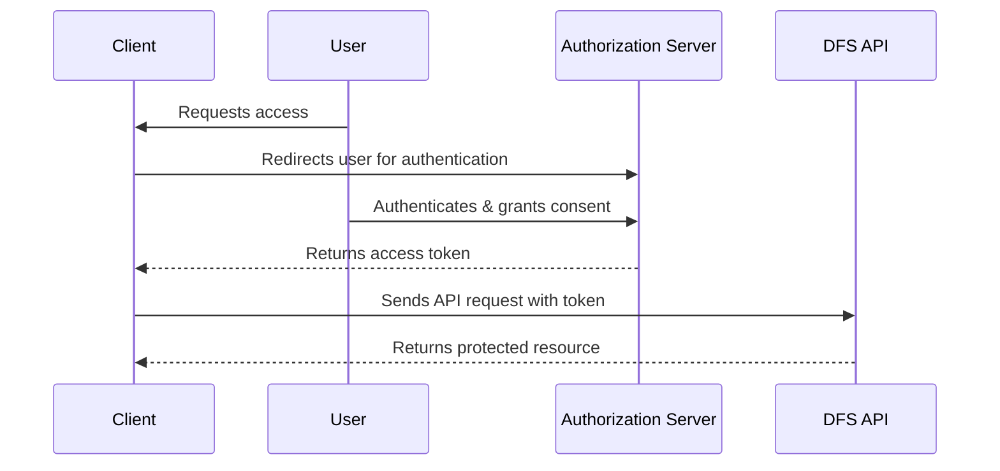

# API Reference

## Overview

The Distributed File System provides both RESTful HTTP APIs and high-performance gRPC APIs for client applications. This document describes all available endpoints, request/response formats, and usage examples.

## Authentication

All API endpoints require authentication using OAuth 2.0 Bearer tokens or API keys.

```http
Authorization: Bearer <access_token>
# OR
X-API-Key: <api_key>
```

## OAuth 2.0 Flow (Simplified Diagram)



**Summary:**  
1. The client redirects the user to the authorization server for authentication.  
2. After user consent, the authorization server issues an access token to the client.  
3. The client includes the token in API requests to access protected resources.

## REST API

### REST API Endpoints Summary

| Operation                | Method & Path                        | Description                                 |
|--------------------------|--------------------------------------|---------------------------------------------|
| Upload File              | `POST /files`                        | Upload a new file                           |
| Download File            | `GET /files/{file_id}`<br>`GET /files?path=...` | Download file by ID or path                 |
| Get File Info            | `GET /files/{file_id}/info`          | Retrieve file metadata                      |
| Update File Metadata     | `PATCH /files/{file_id}/metadata`    | Update file metadata                        |
| Delete File              | `DELETE /files/{file_id}`            | Delete a file                               |
| List Files               | `GET /files?path=...`                | List files in a directory                   |
| Create Directory         | `POST /directories`                  | Create a new directory                      |
| Batch Upload             | `POST /files/batch`                  | Upload multiple files at once               |
| Batch Delete             | `DELETE /files/batch`                | Delete multiple files at once               |
| Get Storage Stats        | `GET /storage/stats`                 | Retrieve storage usage and efficiency stats |
| Get File Storage Details | `GET /files/{file_id}/storage`       | Get detailed storage info for a file        |

See below for detailed request/response formats and usage examples.

### Base URL
```
Production: https://api.dfs.example.com/v1
Staging: https://staging-api.dfs.example.com/v1
```

### File Operations

#### Upload File
Upload a new file to the distributed file system.

```http
POST /files
Content-Type: application/octet-stream
Content-Length: <file_size>
X-File-Path: /path/to/file.txt
X-File-Metadata: {"type": "document", "tags": ["important"]}

<binary_file_data>
```

**Response:**
```json
{
  "id": "f47ac10b-58cc-4372-a567-0e02b2c3d479",
  "path": "/path/to/file.txt",
  "size": 1048576,
  "checksum": "sha256:a665a45920422f9d417e4867efdc4fb8a04a1f3fff1fa07e998e86f7f7a27ae3",
  "created_at": "2025-07-12T10:30:00Z",
  "metadata": {
    "type": "document",
    "tags": ["important"]
  },
  "storage_info": {
    "deduplication_ratio": 0.7,
    "compression_ratio": 0.6,
    "storage_tier": "hot"
  }
}
```

#### Download File
Download a file by ID or path.

```http
GET /files/{file_id}
# OR
GET /files?path=/path/to/file.txt
```

**Headers:**
- `Range: bytes=0-1023` (optional, for partial downloads)
- `Accept-Encoding: gzip, deflate` (optional, for compressed transfer)

**Response:**
```http
HTTP/1.1 200 OK
Content-Type: application/octet-stream
Content-Length: 1048576
Content-Disposition: attachment; filename="file.txt"
ETag: "a665a45920422f9d417e4867efdc4fb8a04a1f3fff1fa07e998e86f7f7a27ae3"
Last-Modified: Thu, 12 Jul 2025 10:30:00 GMT

<binary_file_data>
```

#### Get File Information
Retrieve metadata about a file without downloading its content.

```http
GET /files/{file_id}/info
```

**Response:**
```json
{
  "id": "f47ac10b-58cc-4372-a567-0e02b2c3d479",
  "path": "/path/to/file.txt",
  "size": 1048576,
  "checksum": "sha256:a665a45920422f9d417e4867efdc4fb8a04a1f3fff1fa07e998e86f7f7a27ae3",
  "created_at": "2025-07-12T10:30:00Z",
  "modified_at": "2025-07-12T10:30:00Z",
  "accessed_at": "2025-07-12T11:45:00Z",
  "metadata": {
    "type": "document",
    "tags": ["important"]
  },
  "storage_info": {
    "deduplication_ratio": 0.7,
    "compression_ratio": 0.6,
    "storage_tier": "hot",
    "replicas": 3,
    "locations": ["us-west-1", "us-east-1"]
  },
  "access_stats": {
    "total_downloads": 42,
    "last_7_days_downloads": 5,
    "bandwidth_used": 44040192
  }
}
```

#### Update File Metadata
Update file metadata without changing the file content.

```http
PATCH /files/{file_id}/metadata
Content-Type: application/json

{
  "metadata": {
    "type": "document",
    "tags": ["important", "archived"],
    "description": "Important document for Q3 planning"
  }
}
```

#### Delete File
Delete a file from the system.

```http
DELETE /files/{file_id}
```

**Response:**
```json
{
  "message": "File deleted successfully",
  "deleted_at": "2025-07-12T12:00:00Z"
}
```

### Directory Operations

#### List Files
List files in a directory with pagination and filtering.

```http
GET /files?path=/documents&limit=50&offset=0&sort=created_at&order=desc
```

**Query Parameters:**
- `path` (string): Directory path to list
- `limit` (int): Maximum number of files to return (default: 50, max: 1000)
- `offset` (int): Number of files to skip (default: 0)
- `sort` (string): Sort field (name, size, created_at, modified_at)
- `order` (string): Sort order (asc, desc)
- `filter` (string): Search filter for file names
- `metadata_filter` (string): JSON filter for metadata fields

**Response:**
```json
{
  "files": [
    {
      "id": "f47ac10b-58cc-4372-a567-0e02b2c3d479",
      "path": "/documents/report.pdf",
      "size": 2097152,
      "created_at": "2025-07-12T10:30:00Z",
      "metadata": {
        "type": "pdf",
        "tags": ["report"]
      }
    }
  ],
  "pagination": {
    "total": 150,
    "limit": 50,
    "offset": 0,
    "has_more": true
  }
}
```

#### Create Directory
Create a new directory.

```http
POST /directories
Content-Type: application/json

{
  "path": "/documents/2025/q3",
  "metadata": {
    "description": "Q3 2025 documents",
    "owner": "finance-team"
  }
}
```

### Batch Operations

#### Batch Upload
Upload multiple files in a single request.

```http
POST /files/batch
Content-Type: multipart/form-data
X-Batch-Options: {"parallel": true, "fail_fast": false}

--boundary
Content-Disposition: form-data; name="files"; filename="file1.txt"
Content-Type: text/plain

<file1_content>
--boundary
Content-Disposition: form-data; name="files"; filename="file2.txt"
Content-Type: text/plain

<file2_content>
--boundary--
```

**Response:**
```json
{
  "results": [
    {
      "filename": "file1.txt",
      "status": "success",
      "file_id": "f47ac10b-58cc-4372-a567-0e02b2c3d479"
    },
    {
      "filename": "file2.txt",
      "status": "error",
      "error": "File already exists"
    }
  ],
  "summary": {
    "total": 2,
    "successful": 1,
    "failed": 1
  }
}
```

#### Batch Delete
Delete multiple files in a single request.

```http
DELETE /files/batch
Content-Type: application/json

{
  "file_ids": [
    "f47ac10b-58cc-4372-a567-0e02b2c3d479",
    "a1b2c3d4-58cc-4372-a567-0e02b2c3d480"
  ]
}
```

### Storage Management

#### Get Storage Statistics
Retrieve storage usage and efficiency statistics.

```http
GET /storage/stats
```

**Response:**
```json
{
  "total_capacity": 1099511627776,
  "used_capacity": 659706976256,
  "available_capacity": 439804651520,
  "utilization_percentage": 60.0,
  "efficiency": {
    "deduplication_ratio": 3.2,
    "compression_ratio": 2.8,
    "overall_efficiency": 5.5,
    "space_saved": 2637827906048
  },
  "tier_distribution": {
    "hot": {
      "capacity": 109951162777,
      "used": 65970697625,
      "files": 10000
    },
    "warm": {
      "capacity": 549755813888,
      "used": 329853488537,
      "files": 50000
    },
    "cold": {
      "capacity": 439804651111,
      "used": 263882790094,
      "files": 100000
    }
  }
}
```

#### Get File Storage Details
Get detailed storage information for a specific file.

```http
GET /files/{file_id}/storage
```

**Response:**
```json
{
  "file_id": "f47ac10b-58cc-4372-a567-0e02b2c3d479",
  "storage_tier": "hot",
  "chunks": [
    {
      "chunk_id": "chunk_001",
      "size": 65536,
      "compressed_size": 39321,
      "compression_algorithm": "lz4",
      "hash": "sha256:b5d4045c3f466fa91fe2cc6abe79232a1a57cdf104f7a26e716e0a1e2789df78",
      "locations": [
        {"node": "storage-node-1", "rack": "rack-a", "datacenter": "us-west-1"},
        {"node": "storage-node-5", "rack": "rack-c", "datacenter": "us-west-1"}
      ],
      "erasure_coding": {
        "data_shards": 6,
        "parity_shards": 3,
        "shard_size": 10922
      }
    }
  ],
  "deduplication": {
    "unique_chunks": 8,
    "total_chunks": 16,
    "ratio": 0.5,
    "space_saved": 524288
  }
}
```

## gRPC API

### Service Definition

```protobuf
syntax = "proto3";

package dfs.v1;

service FileSystemService {
  // File operations
  rpc UploadFile(stream UploadRequest) returns (UploadResponse);
  rpc DownloadFile(DownloadRequest) returns (stream DownloadResponse);
  rpc GetFileInfo(GetFileInfoRequest) returns (FileInfo);
  rpc DeleteFile(DeleteFileRequest) returns (DeleteFileResponse);
  rpc UpdateFileMetadata(UpdateFileMetadataRequest) returns (FileInfo);
  
  // Directory operations
  rpc ListFiles(ListFilesRequest) returns (ListFilesResponse);
  rpc CreateDirectory(CreateDirectoryRequest) returns (CreateDirectoryResponse);
  
  // Batch operations
  rpc BatchUpload(stream BatchUploadRequest) returns (stream BatchUploadResponse);
  rpc BatchDelete(BatchDeleteRequest) returns (BatchDeleteResponse);
  
  // Storage operations
  rpc GetStorageStats(GetStorageStatsRequest) returns (StorageStats);
  rpc GetFileStorage(GetFileStorageRequest) returns (FileStorageInfo);
}
```

### Message Definitions

```protobuf
message UploadRequest {
  oneof data {
    FileMetadata metadata = 1;
    bytes chunk = 2;
  }
}

message FileMetadata {
  string path = 1;
  map<string, string> metadata = 2;
  string checksum = 3;
  uint64 size = 4;
  ConsistencyLevel consistency = 5;
}

enum ConsistencyLevel {
  EVENTUAL = 0;
  READ_AFTER_WRITE = 1;
  STRONG = 2;
}

message UploadResponse {
  string file_id = 1;
  string path = 2;
  uint64 size = 3;
  string checksum = 4;
  google.protobuf.Timestamp created_at = 5;
  StorageInfo storage_info = 6;
}

message DownloadRequest {
  oneof identifier {
    string file_id = 1;
    string path = 2;
  }
  optional Range range = 3;
  optional string version = 4;
}

message Range {
  uint64 start = 1;
  uint64 end = 2;
}

message DownloadResponse {
  oneof data {
    FileInfo info = 1;
    bytes chunk = 2;
  }
}
```

### Client Usage Examples

#### Go Client
```go
package main

import (
    "context"
    "io"
    "log"
    
    "google.golang.org/grpc"
    pb "github.com/example/dfs/api/v1"
)

func uploadFile(client pb.FileSystemServiceClient, filePath string, data []byte) {
    stream, err := client.UploadFile(context.Background())
    if err != nil {
        log.Fatal(err)
    }
    
    // Send metadata
    err = stream.Send(&pb.UploadRequest{
        Data: &pb.UploadRequest_Metadata{
            Metadata: &pb.FileMetadata{
                Path: filePath,
                Size: uint64(len(data)),
                Metadata: map[string]string{
                    "type": "document",
                },
                Consistency: pb.ConsistencyLevel_READ_AFTER_WRITE,
            },
        },
    })
    if err != nil {
        log.Fatal(err)
    }
    
    // Send data in chunks
    chunkSize := 64 * 1024
    for i := 0; i < len(data); i += chunkSize {
        end := i + chunkSize
        if end > len(data) {
            end = len(data)
        }
        
        err = stream.Send(&pb.UploadRequest{
            Data: &pb.UploadRequest_Chunk{
                Chunk: data[i:end],
            },
        })
        if err != nil {
            log.Fatal(err)
        }
    }
    
    resp, err := stream.CloseAndRecv()
    if err != nil {
        log.Fatal(err)
    }
    
    log.Printf("Uploaded file: %s (ID: %s)", resp.Path, resp.FileId)
}

func downloadFile(client pb.FileSystemServiceClient, fileID string) []byte {
    stream, err := client.DownloadFile(context.Background(), &pb.DownloadRequest{
        Identifier: &pb.DownloadRequest_FileId{FileId: fileID},
    })
    if err != nil {
        log.Fatal(err)
    }
    
    var data []byte
    for {
        resp, err := stream.Recv()
        if err == io.EOF {
            break
        }
        if err != nil {
            log.Fatal(err)
        }
        
        switch resp.Data.(type) {
        case *pb.DownloadResponse_Info:
            log.Printf("File info: %v", resp.GetInfo())
        case *pb.DownloadResponse_Chunk:
            data = append(data, resp.GetChunk()...)
        }
    }
    
    return data
}
```

#### Python Client
```python
import grpc
from dfs.api.v1 import file_system_pb2
from dfs.api.v1 import file_system_pb2_grpc

class DFSClient:
    def __init__(self, server_address):
        self.channel = grpc.insecure_channel(server_address)
        self.stub = file_system_pb2_grpc.FileSystemServiceStub(self.channel)
    
    def upload_file(self, file_path, data, metadata=None):
        def request_generator():
            # Send metadata first
            yield file_system_pb2.UploadRequest(
                metadata=file_system_pb2.FileMetadata(
                    path=file_path,
                    size=len(data),
                    metadata=metadata or {},
                    consistency=file_system_pb2.ConsistencyLevel.READ_AFTER_WRITE
                )
            )
            
            # Send data in chunks
            chunk_size = 64 * 1024
            for i in range(0, len(data), chunk_size):
                chunk = data[i:i + chunk_size]
                yield file_system_pb2.UploadRequest(chunk=chunk)
        
        response = self.stub.UploadFile(request_generator())
        return response
    
    def download_file(self, file_id):
        request = file_system_pb2.DownloadRequest(file_id=file_id)
        stream = self.stub.DownloadFile(request)
        
        data = b''
        file_info = None
        
        for response in stream:
            if response.HasField('info'):
                file_info = response.info
            elif response.HasField('chunk'):
                data += response.chunk
        
        return file_info, data
```

## Error Handling

### HTTP Status Codes
- `200 OK`: Request successful
- `201 Created`: Resource created successfully
- `204 No Content`: Request successful, no content to return
- `400 Bad Request`: Invalid request parameters
- `401 Unauthorized`: Authentication required
- `403 Forbidden`: Access denied
- `404 Not Found`: Resource not found
- `409 Conflict`: Resource already exists or conflict
- `413 Payload Too Large`: File size exceeds limits
- `422 Unprocessable Entity`: Validation errors
- `429 Too Many Requests`: Rate limit exceeded
- `500 Internal Server Error`: Server error
- `503 Service Unavailable`: Service temporarily unavailable

### Error Response Format
```json
{
  "error": {
    "code": "FILE_NOT_FOUND",
    "message": "The specified file was not found",
    "details": {
      "file_id": "f47ac10b-58cc-4372-a567-0e02b2c3d479",
      "path": "/documents/missing.txt"
    },
    "request_id": "req_1234567890abcdef"
  }
}
```

### gRPC Error Codes
- `OK`: Success
- `INVALID_ARGUMENT`: Invalid request parameters
- `NOT_FOUND`: Resource not found
- `ALREADY_EXISTS`: Resource already exists
- `PERMISSION_DENIED`: Access denied
- `UNAUTHENTICATED`: Authentication required
- `RESOURCE_EXHAUSTED`: Rate limit or quota exceeded
- `FAILED_PRECONDITION`: Precondition not met
- `UNAVAILABLE`: Service temporarily unavailable
- `INTERNAL`: Internal server error

## Rate Limits

### Default Limits
- **API Requests**: 10,000 requests per hour per API key
- **Upload Bandwidth**: 1 GB per minute per API key
- **Download Bandwidth**: 10 GB per minute per API key
- **Concurrent Connections**: 100 per API key

### Rate Limit Headers
```http
X-RateLimit-Limit: 10000
X-RateLimit-Remaining: 9999
X-RateLimit-Reset: 1625562000
X-RateLimit-Window: 3600
```

## SDKs and Libraries

### Official SDKs
- **Go**: `github.com/example/dfs-go-sdk`
- **Python**: `pip install dfs-python-sdk`
- **Java**: `com.example:dfs-java-sdk`
- **JavaScript/Node.js**: `npm install @example/dfs-js-sdk`
- **C#/.NET**: `Example.DFS.SDK`

### Community SDKs
- **Rust**: `dfs-rust-client`
- **PHP**: `example/dfs-php-client`
- **Ruby**: `dfs-ruby-gem`

This API reference provides comprehensive documentation for integrating with the distributed file system, supporting both REST and gRPC protocols for maximum flexibility and performance.
