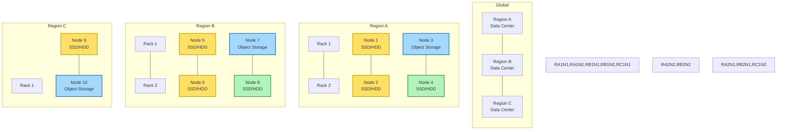

# Storage Optimization Strategy

## Overview

Storage optimization is the cornerstone of our distributed file system design. This document outlines comprehensive strategies to maximize storage efficiency while maintaining high performance and availability.

## Physical Storage Architecture

The distributed file system leverages a multi-layered storage architecture spanning multiple physical locations for resilience, performance, and cost optimization. Storage is physically distributed across:

- **Data Centers**: Multiple geographic regions for disaster recovery and latency optimization.
- **Racks**: Each data center contains multiple racks for fault isolation.
- **Nodes**: Each rack hosts several storage nodes (servers) with different storage media (SSD, HDD, Object Storage).

### Storage Layer Layout



**Legend:**
- **Yellow (Hot Tier)**: SSD storage for high-access data
- **Green (Warm Tier)**: HDD storage for medium-access data
- **Blue (Cold Tier)**: Object storage for archival/low-access data

This architecture ensures data is distributed and tiered across physical locations, racks, and nodes, supporting high availability, durability, and efficient storage optimization.

## Cloud-Native Storage Architecture

### Container-Based Storage Nodes

The distributed file system operates as a **cloud-native, containerized system** deployed on managed Kubernetes platforms. Storage optimization runs in specialized microservices rather than dedicated physical hardware:

#### **Hot Tier Containers (High-Performance)**
```yaml
hot_tier_pods:
  container_specs:
    cpu: "4000m-8000m"
    memory: "32Gi-64Gi"
    storage: "NVMe SSD via CSI drivers"
    
  cloud_instance_types:
    aws: ["i4i.4xlarge", "i4i.8xlarge"]     # Up to 15GB/s NVMe
    gcp: ["n2-highmem-16"]                  # Local SSD
    azure: ["Standard_L16s_v3"]             # Local NVMe
    
  kubernetes_resources:
    storage_class: "nvme-ssd"
    provisioner: "kubernetes.io/aws-ebs"
    volume_type: "gp3"
    iops: "16000"
```

#### **Warm Tier Containers (Balanced Performance)**
```yaml
warm_tier_pods:
  container_specs:
    cpu: "2000m-4000m"
    memory: "16Gi-32Gi"
    storage: "High-performance SSD via persistent volumes"
    
  cloud_instance_types:
    aws: ["d3.4xlarge", "d3.8xlarge"]       # HDD with SSD cache
    gcp: ["n2-standard-16"]                 # Balanced compute
    azure: ["Standard_D16s_v5"]             # General purpose
    
  kubernetes_resources:
    storage_class: "standard-ssd"
    volume_type: "gp3"
    iops: "3000"
```

#### **Cold Tier Integration (Object Storage)**
```yaml
cold_tier_gateway:
  container_specs:
    cpu: "1000m-2000m"
    memory: "4Gi-8Gi"
    storage: "Object storage integration"
    
  object_storage_backends:
    aws_s3:
      storage_class: "STANDARD_IA"
      lifecycle: "Glacier after 90 days"
    gcp_gcs:
      storage_class: "NEARLINE"
      lifecycle: "Coldline after 90 days"
    azure_blob:
      storage_class: "Cool"
      lifecycle: "Archive after 90 days"
```

### Deployment Flexibility

#### **Multi-Cloud Support**
- **Primary Deployment**: Managed Kubernetes (EKS, GKE, AKS)
- **Hybrid Support**: On-premises Kubernetes + cloud tiers
- **Edge Deployment**: K3s for edge locations
- **Private Cloud**: OpenShift, Rancher, Tanzu

#### **Auto-Scaling Configuration**
```yaml
auto_scaling:
  hot_tier:
    min_replicas: 9     # For 6+3 erasure coding
    max_replicas: 50
    cpu_threshold: 70%
    
  warm_tier:
    min_replicas: 6
    max_replicas: 30
    cpu_threshold: 80%
    
  compression_engine:
    min_replicas: 4
    max_replicas: 20
    queue_length_threshold: 100
```

### Container Runtime Optimization

#### **Storage-Optimized Base Images**
- **Base OS**: Alpine Linux or distroless images
- **Runtime**: Go binaries with optimized memory allocation
- **Dependencies**: Minimal external dependencies
- **Security**: Regular vulnerability scanning and updates

#### **Performance Optimizations**
- **CPU Affinity**: Pin compression/deduplication to specific cores
- **Memory Management**: Large pages for buffer pools
- **Network**: SR-IOV and DPDK support where available
- **Storage**: Direct I/O bypass for hot tier access

This cloud-native architecture provides the same storage optimization benefits while eliminating physical infrastructure management complexity.

## 1. Content-Based Deduplication

### Chunking Strategy
```
┌─────────────────────────────────────────────────────────────────┐
│                    File Chunking Process                        │
└─────────────────────────────────────────────────────────────────┘
                                │
                    ┌───────────▼──────────┐
                    │   Variable-Size      │
                    │   Chunking (CDC)     │
                    │   Rabin Fingerprint  │
                    └───────────┬──────────┘
                                │
                    ┌───────────▼──────────┐
                    │   Chunk Size:        │
                    │   Min: 32KB          │
                    │   Avg: 64KB          │
                    │   Max: 128KB         │
                    └───────────┬──────────┘
                                │
                    ┌───────────▼──────────┐
                    │   SHA-256 Hash       │
                    │   Fingerprinting     │
                    └──────────────────────┘
```

#### Content-Defined Chunking (CDC)
- **Algorithm**: Rabin fingerprinting with rolling hash
- **Window Size**: 48 bytes for boundary detection
- **Chunk Boundaries**: Identified by specific bit patterns in rolling hash
- **Advantages**: Maintains chunk boundaries across file modifications

#### Chunk Size Optimization
```go
type ChunkConfig struct {
    MinSize    int    // 32KB - prevents excessive metadata overhead
    MaxSize    int    // 128KB - limits chunk transfer time
    AvgSize    int    // 64KB - optimal balance for most workloads
    WindowSize int    // 48 bytes - rolling hash window
}
```

### Global Deduplication Index

#### Index Architecture
```
┌─────────────────────────────────────────────────────────────────┐
│                  Global Dedup Index                             │
├─────────────────┬─────────────────┬─────────────────────────────┤
│   Hash Shard 0  │   Hash Shard 1  │      Hash Shard N           │
│   Chunks: 0-F   │   Chunks: 10-1F │      Chunks: ...            │
└─────────────────┴─────────────────┴─────────────────────────────┘
```

#### Sharding Strategy
- **Consistent Hashing**: SHA-256(chunk_hash)[0:8] % num_shards
- **Virtual Nodes**: 256 virtual nodes per physical shard for load balancing
- **Replication**: 3-way replication of index data for availability

#### Index Storage Format
```protobuf
message ChunkIndex {
    string chunk_hash = 1;           // SHA-256 fingerprint
    repeated ChunkLocation locations = 2;  // Where chunk is stored
    uint64 size = 3;                 // Chunk size in bytes
    uint64 ref_count = 4;            // Reference count
    uint64 last_access = 5;          // Last access timestamp
    CompressionType compression = 6;  // Compression algorithm used
}

message ChunkLocation {
    string node_id = 1;              // Storage node identifier
    string storage_path = 2;         // Path within storage node
    uint32 erasure_group_id = 3;     // Erasure coding group
}
```

### Deduplication Performance Optimization

#### Bloom Filters
- **Purpose**: Fast negative lookups for chunk existence
- **Size**: 1GB per shard (1% false positive rate)
- **Updates**: Asynchronous updates to maintain consistency

#### Caching Strategy
- **Hot Chunks**: Cache frequently accessed chunk metadata in Redis
- **Cache Size**: 10GB cluster-wide cache for chunk locations
- **TTL**: 24 hours with LRU eviction

## 2. Multi-Tier Compression

### Compression Algorithm Selection

#### Tier 1: Hot Data (High Frequency Access)
- **Algorithm**: LZ4
- **Compression Ratio**: 2.5x average
- **Compression Speed**: 400 MB/s
- **Decompression Speed**: 1200 MB/s
- **Use Case**: Frequently accessed files, real-time data

#### Tier 2: Warm Data (Medium Frequency Access)
- **Algorithm**: Zstandard (ZSTD)
- **Compression Ratio**: 3.5x average
- **Compression Speed**: 100 MB/s
- **Decompression Speed**: 300 MB/s
- **Use Case**: Moderately accessed files, daily operations

#### Tier 3: Cold Data (Low Frequency Access)
- **Algorithm**: LZMA2
- **Compression Ratio**: 5x average
- **Compression Speed**: 20 MB/s
- **Decompression Speed**: 50 MB/s
- **Use Case**: Archive data, long-term storage

### Adaptive Compression Engine

#### ML-Based Algorithm Selection
```python
class CompressionPredictor:
    def __init__(self):
        self.model = XGBoostClassifier()
        self.features = [
            'file_size',
            'file_type',
            'access_frequency',
            'entropy',
            'compression_ratio_estimate'
        ]
    
    def predict_algorithm(self, file_metadata):
        """Predict optimal compression algorithm"""
        features = self.extract_features(file_metadata)
        return self.model.predict(features)
```

#### Feature Engineering
- **File Type Analysis**: MIME type and extension-based classification
- **Entropy Calculation**: Shannon entropy for compressibility estimation
- **Access Pattern**: Historical access frequency and recency
- **Size Distribution**: File size patterns for algorithm optimization

### Dynamic Recompression

#### Trigger Conditions
- **Access Pattern Change**: File moves between hot/warm/cold tiers
- **Better Algorithm Available**: Model identifies superior compression option
- **Storage Pressure**: Need for additional space optimization

#### Recompression Process
```go
func (c *CompressionService) RecompressChunk(chunkID string) error {
    // 1. Fetch current chunk
    chunk, err := c.storage.GetChunk(chunkID)
    if err != nil {
        return err
    }
    
    // 2. Decompress to original data
    original, err := c.Decompress(chunk)
    if err != nil {
        return err
    }
    
    // 3. Select new algorithm
    newAlgo := c.predictor.SelectAlgorithm(chunk.Metadata)
    
    // 4. Recompress with new algorithm
    newChunk, err := c.CompressWithAlgorithm(original, newAlgo)
    if err != nil {
        return err
    }
    
    // 5. Atomic replacement
    return c.storage.ReplaceChunk(chunkID, newChunk)
}
```

## 3. Erasure Coding

### Reed-Solomon Implementation

#### Configuration Options
```go
type ErasureConfig struct {
    DataShards   int    // Number of data shards (default: 6)
    ParityShards int    // Number of parity shards (default: 3)
    ShardSize    int    // Size of each shard (aligned with chunk size)
    MinShards    int    // Minimum shards needed for reconstruction (6)
}
```

#### Storage Efficiency Comparison
```
Replication (3x):     300% storage overhead
Erasure (6+3):        150% storage overhead
Erasure (10+4):       140% storage overhead
Erasure (14+6):       143% storage overhead

Optimal: 6+3 configuration provides best balance of efficiency and performance
```

### Shard Placement Strategy

#### Geographic Distribution
```
┌─────────────────────────────────────────────────────────────────┐
│                    Shard Placement                              │
├─────────────────┬─────────────────┬─────────────────────────────┤
│   Region A      │   Region B      │      Region C               │
│   3 data +      │   3 data +      │      3 parity               │
│   1 parity      │   1 parity      │                             │
└─────────────────┴─────────────────┴─────────────────────────────┘
```

#### Placement Constraints
- **Rack Diversity**: No two shards on same rack
- **Bandwidth Optimization**: Minimize cross-region traffic for reads
- **Latency Awareness**: Place frequently accessed shards closer to clients

### Fast Reconstruction

#### Partial Reconstruction
- **Smart Repair**: Only reconstruct missing shards, not entire objects
- **Parallel Recovery**: Reconstruct multiple shards simultaneously
- **Bandwidth Optimization**: Use closest available shards for reconstruction

#### Hot Spare Strategy
- **Proactive Replacement**: Immediately start reconstruction on failure
- **Spare Pools**: Maintain pools of spare storage capacity
- **Load Balancing**: Distribute reconstruction load across cluster

## 4. Data Tiering

### Tier Classification

#### Hot Tier (SSD Storage)
- **Access Pattern**: > 10 accesses/day
- **Storage Medium**: NVMe SSDs
- **Retention**: 30 days minimum
- **Compression**: LZ4 for fast access
- **Replication**: 3x for performance

#### Warm Tier (HDD Storage)
- **Access Pattern**: 1-10 accesses/week
- **Storage Medium**: High-performance HDDs
- **Retention**: 90 days
- **Compression**: ZSTD for balanced performance
- **Erasure Coding**: 6+3 configuration

#### Cold Tier (Object Storage)
- **Access Pattern**: < 1 access/month
- **Storage Medium**: S3-compatible object storage
- **Retention**: Indefinite
- **Compression**: LZMA2 for maximum efficiency
- **Erasure Coding**: 14+6 for high durability

### Automated Tiering

#### Machine Learning Model
```python
class TieringPredictor:
    def __init__(self):
        self.model = RandomForestRegressor()
        self.features = [
            'days_since_creation',
            'access_frequency_7d',
            'access_frequency_30d',
            'file_size',
            'file_type',
            'user_tier',
            'seasonal_patterns'
        ]
    
    def predict_next_access(self, file_metadata):
        """Predict when file will be accessed next"""
        features = self.extract_features(file_metadata)
        return self.model.predict(features)
```

#### Tiering Rules Engine
```yaml
tiering_rules:
  hot_to_warm:
    condition: "access_frequency_7d < 1 AND days_since_last_access > 7"
    action: "migrate_to_warm"
    
  warm_to_cold:
    condition: "access_frequency_30d < 1 AND days_since_last_access > 30"
    action: "migrate_to_cold"
    
  cold_to_archive:
    condition: "days_since_last_access > 365"
    action: "migrate_to_archive"
```

## 5. Advanced Optimization Techniques

### Delta Compression

#### Use Cases
- **Version Control**: Store only differences between file versions
- **Backup Systems**: Incremental backup with delta compression
- **Content Updates**: Efficiently handle content modifications

#### Implementation
```go
type DeltaCompression struct {
    baseVersion string    // Reference to base version
    deltaData   []byte    // Compressed delta
    algorithm   string    // Delta algorithm (xdelta, bsdiff)
}

func (d *DeltaCompression) Reconstruct(baseData []byte) ([]byte, error) {
    switch d.algorithm {
    case "xdelta":
        return xdelta.Apply(baseData, d.deltaData)
    case "bsdiff":
        return bsdiff.Apply(baseData, d.deltaData)
    default:
        return nil, ErrUnsupportedAlgorithm
    }
}
```

### Intelligent Prefetching

#### Access Pattern Learning
- **Sequential Access**: Prefetch next chunks in sequence
- **Spatial Locality**: Prefetch nearby chunks
- **Temporal Patterns**: Learn user-specific access patterns

#### Prefetch Cache Management
```go
type PrefetchManager struct {
    cache       *LRUCache
    predictor   *AccessPredictor
    bandwidth   *BandwidthManager
    hitRate     metrics.Counter
}

func (p *PrefetchManager) PrefetchChunks(currentChunk string) {
    // Predict next chunks based on access patterns
    candidates := p.predictor.PredictNext(currentChunk)
    
    // Filter by available bandwidth
    prioritized := p.bandwidth.PrioritizeByBandwidth(candidates)
    
    // Asynchronously prefetch
    go p.asyncPrefetch(prioritized)
}
```

### Cross-Datacenter Optimization

#### Data Locality
- **Geographic Caching**: Cache popular content in each region
- **Demand-Based Replication**: Replicate hot data to high-demand regions
- **Edge Computing**: Process data closer to users

#### Bandwidth Optimization
- **Compression for Transfer**: Additional compression for cross-DC transfers
- **Delta Sync**: Only transfer changes between datacenters
- **Traffic Shaping**: Prioritize user traffic over background sync

## 6. Storage Efficiency Metrics

### Key Performance Indicators

#### Deduplication Metrics
- **Deduplication Ratio**: Unique data / Total data written
- **Space Savings**: (1 - Deduplication Ratio) × 100%
- **Chunk Hit Rate**: Percentage of chunks found in dedup index

#### Compression Metrics
- **Compression Ratio**: Original size / Compressed size
- **Compression Efficiency**: Space saved per CPU cycle
- **Algorithm Distribution**: Usage percentage of each algorithm

#### Overall Efficiency
```
Total Storage Efficiency = Deduplication Ratio × Compression Ratio × Erasure Efficiency

Example:
- Deduplication: 70% savings (3.33x ratio)
- Compression: 60% savings (2.5x ratio)
- Erasure Coding: 33% overhead (1.5x ratio)

Total Efficiency: 3.33 × 2.5 ÷ 1.5 = 5.55x storage savings
```

### Monitoring and Alerting

#### Real-time Dashboards
- Storage efficiency trends over time
- Deduplication and compression ratios by data type
- Tiering effectiveness and cost optimization

#### Automated Optimization
- Trigger recompression when efficiency drops
- Adjust tiering policies based on access patterns
- Alert on storage efficiency anomalies

This storage optimization strategy provides a foundation for achieving significant storage savings while maintaining high performance and availability for millions of concurrent users.
