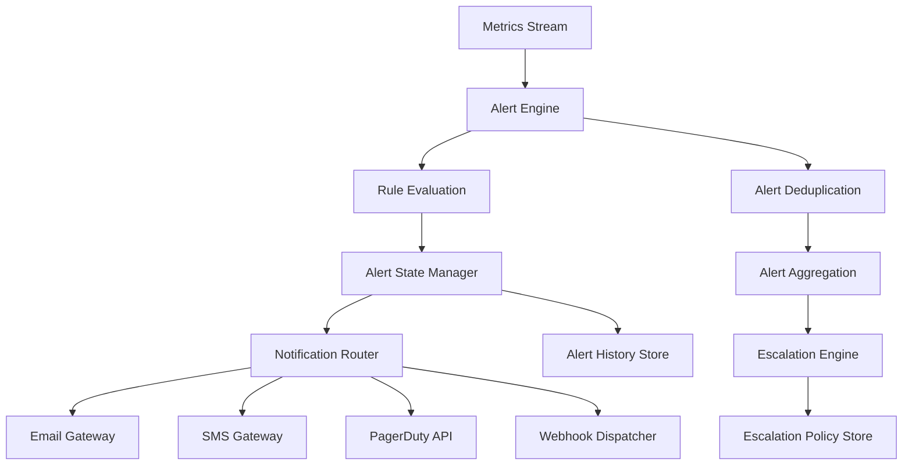

# Alerting Design

## Overview

The alerting system provides real-time monitoring and notification capabilities with support for multiple channels, escalation policies, and intelligent alert management to reduce noise and ensure critical issues are addressed promptly.

## Alerting Architecture



## Alert Rule Configuration

### Rule Structure

```yaml
# alert-rules.yml
alert_rules:
  - name: "high_cpu_usage"
    description: "CPU usage exceeds 80% for 5 minutes"
    metric: "cpu_usage_percent"
    
    condition:
      operator: ">"
      threshold: 80
      duration: "5m"
      aggregation: "avg"
      
    labels:
      severity: "warning"
      team: "infrastructure"
      service: "system"
      
    annotations:
      summary: "High CPU usage detected on {{ $labels.host }}"
      description: "CPU usage is {{ $value }}% on host {{ $labels.host }} in {{ $labels.region }}"
      runbook_url: "https://runbooks.company.com/high-cpu"
      
    filters:
      environment: ["production", "staging"]
      region: ["us-east-1", "us-west-2"]
      
  - name: "memory_exhaustion"
    description: "Memory usage exceeds 90% for 2 minutes"
    metric: "memory_usage_percent"
    
    condition:
      operator: ">"
      threshold: 90
      duration: "2m"
      aggregation: "avg"
      
    labels:
      severity: "critical"
      team: "infrastructure"
      service: "system"
      
    annotations:
      summary: "Memory exhaustion on {{ $labels.host }}"
      description: "Memory usage is {{ $value }}% on host {{ $labels.host }}"
      runbook_url: "https://runbooks.company.com/memory-exhaustion"
      
  - name: "service_down"
    description: "Service is unreachable for 1 minute"
    metric: "service_up"
    
    condition:
      operator: "=="
      threshold: 0
      duration: "1m"
      aggregation: "max"
      
    labels:
      severity: "critical"
      team: "sre"
      
    annotations:
      summary: "Service {{ $labels.service }} is down"
      description: "Service {{ $labels.service }} on {{ $labels.host }} is not responding"
      runbook_url: "https://runbooks.company.com/service-down"

  - name: "error_rate_spike"
    description: "Error rate exceeds 5% for 3 minutes"
    
    query: |
      (
        rate(http_requests_total{status=~"5.."}[5m]) / 
        rate(http_requests_total[5m])
      ) * 100
      
    condition:
      operator: ">"
      threshold: 5
      duration: "3m"
      
    labels:
      severity: "warning"
      team: "backend"
      
    annotations:
      summary: "High error rate on {{ $labels.service }}"
      description: "Error rate is {{ $value }}% on service {{ $labels.service }}"
```

### Complex Alert Rules

```yaml
# Complex alerting scenarios
advanced_alert_rules:
  - name: "disk_space_prediction"
    description: "Disk will be full in next 4 hours based on current trend"
    
    query: |
      predict_linear(
        disk_usage_percent[1h], 4 * 3600
      ) > 95
      
    condition:
      operator: "bool"
      duration: "10m"
      
    labels:
      severity: "warning"
      team: "infrastructure"
      
  - name: "load_balancer_backend_down"
    description: "Load balancer has no healthy backends"
    
    query: |
      sum by (load_balancer) (
        load_balancer_healthy_backends
      ) == 0
      
    condition:
      operator: "bool"
      duration: "30s"
      
    labels:
      severity: "critical"
      team: "infrastructure"
      
  - name: "batch_job_failure"
    description: "Batch job hasn't completed successfully in expected timeframe"
    
    query: |
      time() - max by (job_name) (
        batch_job_last_success_timestamp
      ) > 3600
      
    condition:
      operator: "bool"
      
    labels:
      severity: "warning"
      team: "data"
```

## Alert Engine Implementation

### Rule Evaluation Engine

```python
# alert_engine.py
import asyncio
import logging
from datetime import datetime, timedelta
from typing import Dict, List, Any
from dataclasses import dataclass
from enum import Enum

class AlertState(Enum):
    INACTIVE = "inactive"
    PENDING = "pending"
    FIRING = "firing"
    RESOLVED = "resolved"

class Severity(Enum):
    INFO = "info"
    WARNING = "warning"
    CRITICAL = "critical"

@dataclass
class AlertRule:
    name: str
    metric: str
    condition: Dict[str, Any]
    labels: Dict[str, str]
    annotations: Dict[str, str]
    filters: Dict[str, List[str]]
    
@dataclass
class Alert:
    rule_name: str
    state: AlertState
    severity: Severity
    value: float
    labels: Dict[str, str]
    annotations: Dict[str, str]
    started_at: datetime
    ends_at: datetime = None
    
class AlertEngine:
    def __init__(self, metrics_client, notification_service):
        self.metrics_client = metrics_client
        self.notification_service = notification_service
        self.active_alerts = {}
        self.alert_history = []
        self.logger = logging.getLogger(__name__)
        
    async def evaluate_rules(self, rules: List[AlertRule]):
        """Evaluate all alert rules against current metrics"""
        
        for rule in rules:
            try:
                await self.evaluate_single_rule(rule)
            except Exception as e:
                self.logger.error(f"Error evaluating rule {rule.name}: {e}")
                
    async def evaluate_single_rule(self, rule: AlertRule):
        """Evaluate a single alert rule"""
        
        # Query metrics for the rule
        end_time = datetime.utcnow()
        start_time = end_time - self.parse_duration(rule.condition['duration'])
        
        metrics_data = await self.metrics_client.query_metric(
            metric_name=rule.metric,
            start_time=start_time,
            end_time=end_time,
            filters=rule.filters
        )
        
        # Group metrics by label combination
        grouped_metrics = self.group_metrics_by_labels(metrics_data)
        
        for label_set, values in grouped_metrics.items():
            await self.evaluate_rule_for_label_set(rule, label_set, values)
            
    async def evaluate_rule_for_label_set(self, rule: AlertRule, label_set: tuple, values: List[float]):
        """Evaluate rule for a specific combination of labels"""
        
        # Apply aggregation function
        aggregation = rule.condition.get('aggregation', 'avg')
        aggregated_value = self.apply_aggregation(values, aggregation)
        
        # Check threshold condition
        operator = rule.condition['operator']
        threshold = rule.condition['threshold']
        
        condition_met = self.check_condition(aggregated_value, operator, threshold)
        
        # Get or create alert instance
        alert_key = f"{rule.name}:{hash(label_set)}"
        
        if condition_met:
            await self.handle_firing_alert(rule, alert_key, label_set, aggregated_value)
        else:
            await self.handle_resolved_alert(rule, alert_key, label_set)
            
    async def handle_firing_alert(self, rule: AlertRule, alert_key: str, label_set: tuple, value: float):
        """Handle a firing alert condition"""
        
        if alert_key in self.active_alerts:
            # Alert already exists, update value
            alert = self.active_alerts[alert_key]
            alert.value = value
            
            if alert.state == AlertState.PENDING:
                # Check if alert should transition to firing
                duration_met = (datetime.utcnow() - alert.started_at) >= \
                              self.parse_duration(rule.condition['duration'])
                              
                if duration_met:
                    alert.state = AlertState.FIRING
                    await self.send_alert_notification(alert)
                    
        else:
            # Create new alert
            labels_dict = dict(zip(['host', 'region', 'environment'], label_set))
            labels_dict.update(rule.labels)
            
            alert = Alert(
                rule_name=rule.name,
                state=AlertState.PENDING,
                severity=Severity(rule.labels.get('severity', 'warning')),
                value=value,
                labels=labels_dict,
                annotations=self.render_annotations(rule.annotations, labels_dict, value),
                started_at=datetime.utcnow()
            )
            
            self.active_alerts[alert_key] = alert
            
    async def handle_resolved_alert(self, rule: AlertRule, alert_key: str, label_set: tuple):
        """Handle a resolved alert condition"""
        
        if alert_key in self.active_alerts:
            alert = self.active_alerts[alert_key]
            
            if alert.state == AlertState.FIRING:
                # Send resolution notification
                alert.state = AlertState.RESOLVED
                alert.ends_at = datetime.utcnow()
                
                await self.send_resolution_notification(alert)
                
            # Move to history and remove from active
            self.alert_history.append(alert)
            del self.active_alerts[alert_key]
            
    def check_condition(self, value: float, operator: str, threshold: float) -> bool:
        """Check if alert condition is met"""
        
        if operator == '>':
            return value > threshold
        elif operator == '<':
            return value < threshold
        elif operator == '>=':
            return value >= threshold
        elif operator == '<=':
            return value <= threshold
        elif operator == '==':
            return value == threshold
        elif operator == '!=':
            return value != threshold
        else:
            raise ValueError(f"Unknown operator: {operator}")
            
    def apply_aggregation(self, values: List[float], aggregation: str) -> float:
        """Apply aggregation function to values"""
        
        if not values:
            return 0.0
            
        if aggregation == 'avg':
            return sum(values) / len(values)
        elif aggregation == 'min':
            return min(values)
        elif aggregation == 'max':
            return max(values)
        elif aggregation == 'sum':
            return sum(values)
        elif aggregation == 'count':
            return len(values)
        else:
            raise ValueError(f"Unknown aggregation: {aggregation}")
            
    def render_annotations(self, templates: Dict[str, str], labels: Dict[str, str], value: float) -> Dict[str, str]:
        """Render annotation templates with actual values"""
        
        rendered = {}
        context = {**labels, 'value': value}
        
        for key, template in templates.items():
            # Simple template rendering (in production, use Jinja2 or similar)
            rendered_text = template
            for var_name, var_value in context.items():
                rendered_text = rendered_text.replace(f"{{{{ ${var_name} }}}}", str(var_value))
                rendered_text = rendered_text.replace(f"{{{{ $labels.{var_name} }}}}", str(var_value))
            
            rendered[key] = rendered_text
            
        return rendered
        
    async def send_alert_notification(self, alert: Alert):
        """Send alert notification through appropriate channels"""
        
        await self.notification_service.send_alert(alert)
        self.logger.info(f"Sent alert notification for {alert.rule_name}")
        
    async def send_resolution_notification(self, alert: Alert):
        """Send alert resolution notification"""
        
        await self.notification_service.send_resolution(alert)
        self.logger.info(f"Sent resolution notification for {alert.rule_name}")
```

## Notification System

### Multi-channel Notification Service

```python
# notification_service.py
import asyncio
import smtplib
import requests
from email.mime.text import MIMEText
from email.mime.multipart import MIMEMultipart
from typing import Dict, List
import json

class NotificationService:
    def __init__(self, config: Dict):
        self.config = config
        self.escalation_policies = config.get('escalation_policies', {})
        
    async def send_alert(self, alert: Alert):
        """Send alert through configured channels"""
        
        # Determine notification channels based on severity and team
        channels = self.get_notification_channels(alert)
        
        # Send notifications in parallel
        tasks = []
        for channel in channels:
            if channel['type'] == 'email':
                task = self.send_email_alert(alert, channel)
            elif channel['type'] == 'sms':
                task = self.send_sms_alert(alert, channel)
            elif channel['type'] == 'pagerduty':
                task = self.send_pagerduty_alert(alert, channel)
            elif channel['type'] == 'webhook':
                task = self.send_webhook_alert(alert, channel)
            else:
                continue
                
            tasks.append(task)
            
        if tasks:
            await asyncio.gather(*tasks, return_exceptions=True)
            
    async def send_email_alert(self, alert: Alert, channel: Dict):
        """Send email alert notification"""
        
        subject = f"[{alert.severity.value.upper()}] {alert.annotations.get('summary', alert.rule_name)}"
        
        body = f"""
        Alert: {alert.rule_name}
        Severity: {alert.severity.value}
        Value: {alert.value}
        Started: {alert.started_at}
        
        Description: {alert.annotations.get('description', 'No description')}
        
        Labels:
        {json.dumps(alert.labels, indent=2)}
        
        Runbook: {alert.annotations.get('runbook_url', 'No runbook available')}
        """
        
        msg = MIMEMultipart()
        msg['From'] = channel['from_email']
        msg['To'] = ', '.join(channel['to_emails'])
        msg['Subject'] = subject
        
        msg.attach(MIMEText(body, 'plain'))
        
        # Send email
        with smtplib.SMTP(channel['smtp_host'], channel['smtp_port']) as server:
            if channel.get('use_tls'):
                server.starttls()
            if channel.get('username'):
                server.login(channel['username'], channel['password'])
            
            server.send_message(msg)
            
    async def send_sms_alert(self, alert: Alert, channel: Dict):
        """Send SMS alert notification using Twilio or similar service"""
        
        message = f"{alert.severity.value.upper()}: {alert.annotations.get('summary', alert.rule_name)}"
        
        # Truncate message to SMS limits
        if len(message) > 160:
            message = message[:157] + "..."
            
        # Use Twilio API (example)
        payload = {
            'From': channel['from_number'],
            'To': channel['to_number'],
            'Body': message
        }
        
        auth = (channel['account_sid'], channel['auth_token'])
        url = f"https://api.twilio.com/2010-04-01/Accounts/{channel['account_sid']}/Messages.json"
        
        async with aiohttp.ClientSession() as session:
            async with session.post(url, data=payload, auth=auth) as response:
                if response.status != 201:
                    raise Exception(f"SMS send failed: {response.status}")
                    
    async def send_pagerduty_alert(self, alert: Alert, channel: Dict):
        """Send PagerDuty alert"""
        
        payload = {
            "routing_key": channel['integration_key'],
            "event_action": "trigger",
            "dedup_key": f"{alert.rule_name}:{hash(str(alert.labels))}",
            "payload": {
                "summary": alert.annotations.get('summary', alert.rule_name),
                "source": alert.labels.get('host', 'unknown'),
                "severity": alert.severity.value,
                "component": alert.labels.get('service', 'unknown'),
                "group": alert.labels.get('team', 'unknown'),
                "class": alert.rule_name,
                "custom_details": {
                    "value": alert.value,
                    "labels": alert.labels,
                    "runbook_url": alert.annotations.get('runbook_url')
                }
            }
        }
        
        headers = {
            'Content-Type': 'application/json'
        }
        
        async with aiohttp.ClientSession() as session:
            async with session.post(
                'https://events.pagerduty.com/v2/enqueue',
                json=payload,
                headers=headers
            ) as response:
                if response.status != 202:
                    raise Exception(f"PagerDuty send failed: {response.status}")
                    
    async def send_webhook_alert(self, alert: Alert, channel: Dict):
        """Send webhook notification"""
        
        payload = {
            "alert": {
                "rule_name": alert.rule_name,
                "state": alert.state.value,
                "severity": alert.severity.value,
                "value": alert.value,
                "started_at": alert.started_at.isoformat(),
                "labels": alert.labels,
                "annotations": alert.annotations
            }
        }
        
        headers = {
            'Content-Type': 'application/json'
        }
        
        # Add authentication if configured
        if channel.get('auth_header'):
            headers['Authorization'] = channel['auth_header']
            
        async with aiohttp.ClientSession() as session:
            async with session.post(
                channel['url'],
                json=payload,
                headers=headers,
                timeout=30
            ) as response:
                if response.status not in [200, 201, 202]:
                    raise Exception(f"Webhook send failed: {response.status}")
                    
    def get_notification_channels(self, alert: Alert) -> List[Dict]:
        """Determine notification channels based on alert properties"""
        
        channels = []
        team = alert.labels.get('team', 'default')
        severity = alert.severity
        
        # Get team-specific configuration
        team_config = self.config.get('teams', {}).get(team, {})
        
        # Add channels based on severity
        if severity == Severity.INFO:
            channels.extend(team_config.get('info_channels', []))
        elif severity == Severity.WARNING:
            channels.extend(team_config.get('warning_channels', []))
        elif severity == Severity.CRITICAL:
            channels.extend(team_config.get('critical_channels', []))
            
        return channels
```

### Notification Configuration

```yaml
# notification-config.yml
notification_config:
  teams:
    infrastructure:
      warning_channels:
        - type: email
          to_emails: ["infra-team@company.com"]
          from_email: "alerts@company.com"
          smtp_host: "smtp.company.com"
          smtp_port: 587
          use_tls: true
          
      critical_channels:
        - type: email
          to_emails: ["infra-team@company.com"]
          from_email: "alerts@company.com"
          smtp_host: "smtp.company.com"
          smtp_port: 587
          use_tls: true
          
        - type: pagerduty
          integration_key: "your-pagerduty-integration-key"
          
        - type: sms
          to_number: "+1234567890"
          from_number: "+0987654321"
          account_sid: "twilio-account-sid"
          auth_token: "twilio-auth-token"
          
    backend:
      warning_channels:
        - type: webhook
          url: "https://slack.company.com/webhook/backend-alerts"
          auth_header: "Bearer slack-webhook-token"
          
      critical_channels:
        - type: email
          to_emails: ["backend-team@company.com", "oncall@company.com"]
          
        - type: pagerduty
          integration_key: "backend-pagerduty-key"
          
  escalation_policies:
    infrastructure:
      levels:
        - delay: "0m"
          channels: ["primary_channels"]
        - delay: "15m"
          channels: ["escalation_channels"]
        - delay: "30m"
          channels: ["manager_channels"]
```

## Alert Deduplication and Aggregation

### Deduplication Strategy

```python
# alert_deduplication.py
from datetime import datetime, timedelta
from typing import Dict, List, Set
import hashlib

class AlertDeduplicator:
    def __init__(self, dedup_window_minutes=5):
        self.dedup_window = timedelta(minutes=dedup_window_minutes)
        self.recent_alerts = {}  # fingerprint -> last_sent_time
        
    def should_send_alert(self, alert: Alert) -> bool:
        """Determine if alert should be sent or is a duplicate"""
        
        fingerprint = self.generate_fingerprint(alert)
        now = datetime.utcnow()
        
        if fingerprint in self.recent_alerts:
            last_sent = self.recent_alerts[fingerprint]
            if now - last_sent < self.dedup_window:
                return False  # Duplicate, don't send
                
        # Update last sent time
        self.recent_alerts[fingerprint] = now
        
        # Clean up old entries
        self.cleanup_old_entries(now)
        
        return True
        
    def generate_fingerprint(self, alert: Alert) -> str:
        """Generate unique fingerprint for alert deduplication"""
        
        # Include rule name and key labels
        key_labels = ['host', 'service', 'region', 'environment']
        label_values = []
        
        for label in key_labels:
            if label in alert.labels:
                label_values.append(f"{label}={alert.labels[label]}")
                
        fingerprint_data = f"{alert.rule_name}:{':'.join(sorted(label_values))}"
        return hashlib.md5(fingerprint_data.encode()).hexdigest()
        
    def cleanup_old_entries(self, now: datetime):
        """Remove old deduplication entries"""
        
        cutoff_time = now - self.dedup_window
        expired_keys = [
            fp for fp, last_sent in self.recent_alerts.items()
            if last_sent < cutoff_time
        ]
        
        for key in expired_keys:
            del self.recent_alerts[key]

class AlertAggregator:
    def __init__(self, aggregation_window_minutes=2):
        self.aggregation_window = timedelta(minutes=aggregation_window_minutes)
        self.pending_aggregations = {}
        
    async def add_alert_for_aggregation(self, alert: Alert):
        """Add alert to aggregation buffer"""
        
        aggregation_key = self.get_aggregation_key(alert)
        
        if aggregation_key not in self.pending_aggregations:
            self.pending_aggregations[aggregation_key] = {
                'alerts': [],
                'first_alert_time': datetime.utcnow(),
                'timer_task': None
            }
            
            # Start aggregation timer
            timer_task = asyncio.create_task(
                self.send_aggregated_alert_after_delay(aggregation_key)
            )
            self.pending_aggregations[aggregation_key]['timer_task'] = timer_task
            
        self.pending_aggregations[aggregation_key]['alerts'].append(alert)
        
    def get_aggregation_key(self, alert: Alert) -> str:
        """Generate aggregation key for similar alerts"""
        
        # Aggregate by rule name and service
        service = alert.labels.get('service', 'unknown')
        region = alert.labels.get('region', 'unknown')
        
        return f"{alert.rule_name}:{service}:{region}"
        
    async def send_aggregated_alert_after_delay(self, aggregation_key: str):
        """Send aggregated alert after waiting for the aggregation window"""
        
        await asyncio.sleep(self.aggregation_window.total_seconds())
        
        if aggregation_key in self.pending_aggregations:
            aggregation_data = self.pending_aggregations[aggregation_key]
            alerts = aggregation_data['alerts']
            
            if len(alerts) == 1:
                # Single alert, send as-is
                await self.send_single_alert(alerts[0])
            else:
                # Multiple alerts, send aggregated
                await self.send_aggregated_alert(alerts)
                
            # Clean up
            del self.pending_aggregations[aggregation_key]
            
    async def send_aggregated_alert(self, alerts: List[Alert]):
        """Send an aggregated alert for multiple similar alerts"""
        
        # Create aggregated alert
        first_alert = alerts[0]
        affected_hosts = list(set(alert.labels.get('host', 'unknown') for alert in alerts))
        
        aggregated_alert = Alert(
            rule_name=f"{first_alert.rule_name}_aggregated",
            state=AlertState.FIRING,
            severity=first_alert.severity,
            value=max(alert.value for alert in alerts),
            labels={
                **first_alert.labels,
                'affected_hosts': ','.join(affected_hosts[:5]),  # Limit display
                'total_hosts': str(len(affected_hosts))
            },
            annotations={
                'summary': f"{first_alert.rule_name} affecting {len(affected_hosts)} hosts",
                'description': f"Alert triggered on {len(affected_hosts)} hosts: {', '.join(affected_hosts[:10])}",
                'individual_alerts': str(len(alerts))
            },
            started_at=min(alert.started_at for alert in alerts)
        )
        
        await self.notification_service.send_alert(aggregated_alert)
```

## Escalation Policies

### Escalation Engine

```python
# escalation_engine.py
import asyncio
from datetime import datetime, timedelta
from typing import Dict, List

class EscalationEngine:
    def __init__(self, notification_service, escalation_config):
        self.notification_service = notification_service
        self.escalation_config = escalation_config
        self.active_escalations = {}
        
    async def start_escalation(self, alert: Alert):
        """Start escalation process for a critical alert"""
        
        if alert.severity != Severity.CRITICAL:
            return  # Only escalate critical alerts
            
        team = alert.labels.get('team', 'default')
        escalation_policy = self.escalation_config.get(team)
        
        if not escalation_policy:
            return  # No escalation policy defined
            
        escalation_key = f"{alert.rule_name}:{hash(str(alert.labels))}"
        
        if escalation_key not in self.active_escalations:
            self.active_escalations[escalation_key] = {
                'alert': alert,
                'policy': escalation_policy,
                'current_level': 0,
                'started_at': datetime.utcnow(),
                'escalation_tasks': []
            }
            
            # Start escalation levels
            await self.schedule_escalation_levels(escalation_key)
            
    async def schedule_escalation_levels(self, escalation_key: str):
        """Schedule all escalation levels for an alert"""
        
        escalation_data = self.active_escalations[escalation_key]
        policy = escalation_data['policy']
        
        for level_index, level in enumerate(policy['levels']):
            delay_seconds = self.parse_duration(level['delay']).total_seconds()
            
            task = asyncio.create_task(
                self.send_escalation_level(escalation_key, level_index, delay_seconds)
            )
            escalation_data['escalation_tasks'].append(task)
            
    async def send_escalation_level(self, escalation_key: str, level_index: int, delay_seconds: float):
        """Send escalation notification after delay"""
        
        if delay_seconds > 0:
            await asyncio.sleep(delay_seconds)
            
        # Check if escalation is still active
        if escalation_key not in self.active_escalations:
            return  # Alert was resolved
            
        escalation_data = self.active_escalations[escalation_key]
        alert = escalation_data['alert']
        policy = escalation_data['policy']
        level = policy['levels'][level_index]
        
        # Update alert annotations for escalation
        escalated_alert = Alert(
            rule_name=alert.rule_name,
            state=alert.state,
            severity=alert.severity,
            value=alert.value,
            labels={**alert.labels, 'escalation_level': str(level_index + 1)},
            annotations={
                **alert.annotations,
                'escalation_level': f"Level {level_index + 1}",
                'escalation_delay': level['delay']
            },
            started_at=alert.started_at
        )
        
        # Send notifications for this escalation level
        await self.notification_service.send_escalation(escalated_alert, level['channels'])
        
    async def stop_escalation(self, alert: Alert):
        """Stop escalation when alert is resolved"""
        
        escalation_key = f"{alert.rule_name}:{hash(str(alert.labels))}"
        
        if escalation_key in self.active_escalations:
            escalation_data = self.active_escalations[escalation_key]
            
            # Cancel all pending escalation tasks
            for task in escalation_data['escalation_tasks']:
                if not task.done():
                    task.cancel()
                    
            # Remove from active escalations
            del self.active_escalations[escalation_key]
```

## Alert Dashboard and Management

### Alert Management API

```python
# alert_management_api.py
from flask import Flask, request, jsonify
from datetime import datetime, timedelta

app = Flask(__name__)

@app.route('/api/alerts', methods=['GET'])
def get_alerts():
    """Get current active alerts with filtering"""
    
    # Query parameters
    severity = request.args.get('severity')
    team = request.args.get('team')
    state = request.args.get('state', 'firing')
    limit = int(request.args.get('limit', 100))
    
    # Filter alerts
    filtered_alerts = []
    for alert in alert_engine.active_alerts.values():
        if severity and alert.severity.value != severity:
            continue
        if team and alert.labels.get('team') != team:
            continue
        if state and alert.state.value != state:
            continue
            
        filtered_alerts.append({
            'rule_name': alert.rule_name,
            'state': alert.state.value,
            'severity': alert.severity.value,
            'value': alert.value,
            'labels': alert.labels,
            'annotations': alert.annotations,
            'started_at': alert.started_at.isoformat(),
            'duration': str(datetime.utcnow() - alert.started_at)
        })
        
    # Sort by severity and start time
    severity_order = {'critical': 0, 'warning': 1, 'info': 2}
    filtered_alerts.sort(
        key=lambda x: (severity_order.get(x['severity'], 3), x['started_at'])
    )
    
    return jsonify({
        'alerts': filtered_alerts[:limit],
        'total': len(filtered_alerts)
    })

@app.route('/api/alerts/<alert_id>/silence', methods=['POST'])
def silence_alert(alert_id):
    """Silence an alert for a specified duration"""
    
    data = request.get_json()
    duration_minutes = data.get('duration_minutes', 60)
    reason = data.get('reason', 'Manual silence')
    silenced_by = data.get('silenced_by', 'unknown')
    
    # Add to silence list
    silence_until = datetime.utcnow() + timedelta(minutes=duration_minutes)
    
    alert_engine.silenced_alerts[alert_id] = {
        'silenced_until': silence_until,
        'reason': reason,
        'silenced_by': silenced_by
    }
    
    return jsonify({
        'status': 'success',
        'silenced_until': silence_until.isoformat()
    })

@app.route('/api/alerts/stats', methods=['GET'])
def get_alert_stats():
    """Get alerting statistics"""
    
    now = datetime.utcnow()
    last_24h = now - timedelta(days=1)
    
    stats = {
        'active_alerts': len(alert_engine.active_alerts),
        'alerts_by_severity': {},
        'alerts_by_team': {},
        'alert_history_24h': 0,
        'top_firing_rules': []
    }
    
    # Count by severity
    for alert in alert_engine.active_alerts.values():
        severity = alert.severity.value
        stats['alerts_by_severity'][severity] = stats['alerts_by_severity'].get(severity, 0) + 1
        
        team = alert.labels.get('team', 'unknown')
        stats['alerts_by_team'][team] = stats['alerts_by_team'].get(team, 0) + 1
    
    # Count recent history
    recent_alerts = [
        alert for alert in alert_engine.alert_history
        if alert.started_at > last_24h
    ]
    stats['alert_history_24h'] = len(recent_alerts)
    
    # Top firing rules
    rule_counts = {}
    for alert in alert_engine.active_alerts.values():
        rule_counts[alert.rule_name] = rule_counts.get(alert.rule_name, 0) + 1
        
    stats['top_firing_rules'] = [
        {'rule': rule, 'count': count}
        for rule, count in sorted(rule_counts.items(), key=lambda x: x[1], reverse=True)[:10]
    ]
    
    return jsonify(stats)
```

This comprehensive alerting design provides a robust, scalable solution for monitoring the large-scale infrastructure while minimizing alert fatigue and ensuring critical issues receive appropriate attention through multiple notification channels and escalation policies.
