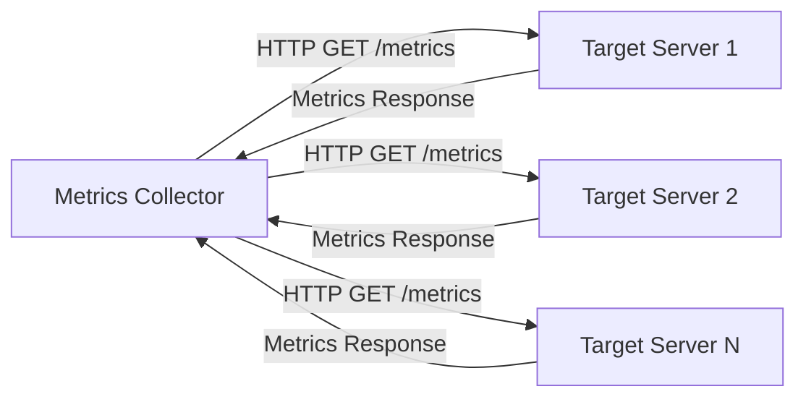
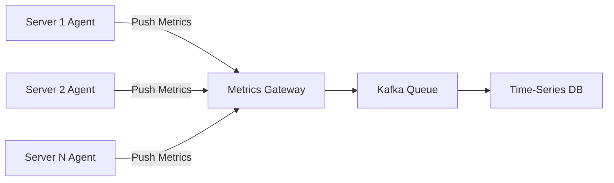

# Metrics Collection Methods

## Overview

The monitoring system supports both pull-based and push-based metric collection methods, each with distinct advantages for different use cases and environments.

## Pull-based Collection (Prometheus Model)

### How It Works

The collector actively requests metrics from target endpoints on a regular schedule.



### Implementation

#### Target Configuration

```yaml
# collector-config.yml
global:
  scrape_interval: 15s
  evaluation_interval: 15s

scrape_configs:
  - job_name: 'web-servers'
    scrape_interval: 10s
    static_configs:
      - targets:
        - 'web-server-01:9090'
        - 'web-server-02:9090'
        - 'web-server-03:9090'
    metrics_path: '/metrics'
    
  - job_name: 'database-servers'
    scrape_interval: 30s
    static_configs:
      - targets:
        - 'db-server-01:9091'
        - 'db-server-02:9091'
    metrics_path: '/db-metrics'

  - job_name: 'kubernetes-pods'
    kubernetes_sd_configs:
      - role: pod
    relabel_configs:
      - source_labels: [__meta_kubernetes_pod_annotation_prometheus_io_scrape]
        action: keep
        regex: true
```

#### Metrics Endpoint Implementation

```python
# Python Flask example
from flask import Flask, Response
import psutil
import time

app = Flask(__name__)

@app.route('/metrics')
def metrics():
    timestamp = int(time.time() * 1000)
    
    # CPU metrics
    cpu_percent = psutil.cpu_percent(interval=1)
    
    # Memory metrics
    memory = psutil.virtual_memory()
    memory_percent = memory.percent
    memory_bytes = memory.used
    
    # Disk metrics
    disk = psutil.disk_usage('/')
    disk_percent = (disk.used / disk.total) * 100
    
    # Network metrics
    net_io = psutil.net_io_counters()
    
    metrics_output = f"""
# HELP cpu_usage_percent CPU usage percentage
# TYPE cpu_usage_percent gauge
cpu_usage_percent{{host="{socket.gethostname()}",region="us-east-1"}} {cpu_percent}

# HELP memory_usage_percent Memory usage percentage
# TYPE memory_usage_percent gauge
memory_usage_percent{{host="{socket.gethostname()}",region="us-east-1"}} {memory_percent}

# HELP memory_usage_bytes Memory usage in bytes
# TYPE memory_usage_bytes gauge
memory_usage_bytes{{host="{socket.gethostname()}",region="us-east-1"}} {memory_bytes}

# HELP disk_usage_percent Disk usage percentage
# TYPE disk_usage_percent gauge
disk_usage_percent{{host="{socket.gethostname()}",region="us-east-1"}} {disk_percent}

# HELP network_bytes_sent Network bytes sent
# TYPE network_bytes_sent counter
network_bytes_sent{{host="{socket.gethostname()}",region="us-east-1"}} {net_io.bytes_sent}

# HELP network_bytes_recv Network bytes received
# TYPE network_bytes_recv counter
network_bytes_recv{{host="{socket.gethostname()}",region="us-east-1"}} {net_io.bytes_recv}
"""
    
    return Response(metrics_output, mimetype='text/plain')

if __name__ == '__main__':
    app.run(host='0.0.0.0', port=9090)
```

### Advantages

1. **Easy Debugging**: Simple HTTP GET request to check metrics
2. **Health Check**: Scraping failure indicates server issues
3. **Centralized Control**: Collector manages all target discovery
4. **Network Efficiency**: TCP reliability for metric collection
5. **Service Discovery**: Integration with orchestration platforms

### Disadvantages

1. **Network Topology**: Requires collector access to all targets
2. **Short-lived Jobs**: Difficult to scrape ephemeral processes
3. **Firewall Issues**: May require opening additional ports
4. **Scaling**: Collector becomes bottleneck at scale

## Push-based Collection (CloudWatch Model)

### How It Works

Agents or applications actively send metrics to the collection endpoint.



### Implementation

#### Push Agent

```python
# metrics_agent.py
import requests
import psutil
import time
import json
import socket
from datetime import datetime

class MetricsAgent:
    def __init__(self, gateway_url, push_interval=10):
        self.gateway_url = gateway_url
        self.push_interval = push_interval
        self.hostname = socket.gethostname()
        
    def collect_system_metrics(self):
        timestamp = int(time.time() * 1000)
        
        metrics = []
        
        # CPU metrics
        cpu_percent = psutil.cpu_percent(interval=1)
        metrics.append({
            "metric_name": "cpu_usage_percent",
            "timestamp": timestamp,
            "value": cpu_percent,
            "labels": {
                "host": self.hostname,
                "region": "us-east-1",
                "environment": "production"
            }
        })
        
        # Memory metrics
        memory = psutil.virtual_memory()
        metrics.append({
            "metric_name": "memory_usage_percent",
            "timestamp": timestamp,
            "value": memory.percent,
            "labels": {
                "host": self.hostname,
                "region": "us-east-1",
                "environment": "production"
            }
        })
        
        metrics.append({
            "metric_name": "memory_usage_bytes",
            "timestamp": timestamp,
            "value": memory.used,
            "labels": {
                "host": self.hostname,
                "region": "us-east-1",
                "environment": "production"
            }
        })
        
        # Disk metrics
        disk = psutil.disk_usage('/')
        disk_percent = (disk.used / disk.total) * 100
        metrics.append({
            "metric_name": "disk_usage_percent",
            "timestamp": timestamp,
            "value": disk_percent,
            "labels": {
                "host": self.hostname,
                "region": "us-east-1",
                "environment": "production"
            }
        })
        
        return metrics
    
    def push_metrics(self, metrics):
        try:
            response = requests.post(
                f"{self.gateway_url}/metrics",
                json={"metrics": metrics},
                timeout=5
            )
            response.raise_for_status()
            print(f"Successfully pushed {len(metrics)} metrics")
        except requests.exceptions.RequestException as e:
            print(f"Failed to push metrics: {e}")
    
    def run(self):
        while True:
            try:
                metrics = self.collect_system_metrics()
                self.push_metrics(metrics)
                time.sleep(self.push_interval)
            except Exception as e:
                print(f"Error in metrics collection: {e}")
                time.sleep(self.push_interval)

if __name__ == "__main__":
    agent = MetricsAgent("http://metrics-gateway:8080", push_interval=15)
    agent.run()
```

#### Metrics Gateway

```python
# metrics_gateway.py
from flask import Flask, request, jsonify
from kafka import KafkaProducer
import json
import hashlib

app = Flask(__name__)

# Kafka producer
producer = KafkaProducer(
    bootstrap_servers=['kafka-1:9092', 'kafka-2:9092'],
    value_serializer=lambda v: json.dumps(v).encode('utf-8'),
    key_serializer=lambda v: v.encode('utf-8') if v else None
)

@app.route('/metrics', methods=['POST'])
def receive_metrics():
    try:
        data = request.get_json()
        metrics = data.get('metrics', [])
        
        for metric in metrics:
            # Validate metric structure
            if not all(key in metric for key in ['metric_name', 'timestamp', 'value', 'labels']):
                return jsonify({"error": "Invalid metric structure"}), 400
            
            # Partition key based on metric name for better distribution
            partition_key = metric['metric_name']
            
            # Send to Kafka
            producer.send(
                'metrics-topic',
                key=partition_key,
                value=metric
            )
        
        producer.flush()
        return jsonify({"status": "success", "metrics_received": len(metrics)}), 200
        
    except Exception as e:
        return jsonify({"error": str(e)}), 500

@app.route('/health', methods=['GET'])
def health_check():
    return jsonify({"status": "healthy"}), 200

if __name__ == '__main__':
    app.run(host='0.0.0.0', port=8080)
```

### Advantages

1. **Short-lived Jobs**: Perfect for ephemeral processes and batch jobs
2. **Complex Networks**: Works with NAT and complex network topologies
3. **Performance**: UDP option for high-throughput, low-latency scenarios
4. **Decentralized**: No single point of failure for collection
5. **Real-time**: Immediate metric delivery

### Disadvantages

1. **Agent Management**: Requires installing and maintaining agents
2. **Debugging Difficulty**: Harder to troubleshoot metric collection issues
3. **Network Overhead**: Potentially higher network traffic
4. **Authentication**: More complex security model
5. **Serverless Limitations**: Doesn't work well with serverless functions

## Hybrid Approach

### Combined Collection Strategy

```yaml
# collection-strategy.yml
collection_methods:
  pull_targets:
    - type: "long_running_services"
      services: ["web-servers", "api-servers", "databases"]
      scrape_interval: 15s
      
    - type: "infrastructure"
      services: ["load-balancers", "proxies"]
      scrape_interval: 30s
      
  push_targets:
    - type: "batch_jobs"
      services: ["etl-jobs", "backup-jobs"]
      push_gateway: "http://push-gateway:9091"
      
    - type: "ephemeral_services"
      services: ["lambda-functions", "containers"]
      metrics_gateway: "http://metrics-gateway:8080"
      
    - type: "edge_devices"
      services: ["iot-devices", "mobile-apps"]
      metrics_gateway: "http://metrics-gateway:8080"
```

## Performance Considerations

### Pull-based Optimizations

1. **Connection Pooling**: Reuse HTTP connections
2. **Concurrent Scraping**: Parallel collection from multiple targets
3. **Compression**: Use gzip compression for metric responses
4. **Caching**: Cache DNS lookups and target discovery

```python
# Optimized pull collector
import asyncio
import aiohttp
import time

class AsyncMetricsCollector:
    def __init__(self, targets, scrape_interval=15):
        self.targets = targets
        self.scrape_interval = scrape_interval
        
    async def scrape_target(self, session, target):
        try:
            async with session.get(
                f"http://{target}/metrics",
                timeout=aiohttp.ClientTimeout(total=10)
            ) as response:
                metrics_text = await response.text()
                return self.parse_metrics(metrics_text, target)
        except Exception as e:
            print(f"Failed to scrape {target}: {e}")
            return []
    
    async def scrape_all_targets(self):
        async with aiohttp.ClientSession() as session:
            tasks = [
                self.scrape_target(session, target) 
                for target in self.targets
            ]
            results = await asyncio.gather(*tasks, return_exceptions=True)
            
            all_metrics = []
            for result in results:
                if isinstance(result, list):
                    all_metrics.extend(result)
            
            return all_metrics
```

### Push-based Optimizations

1. **Batching**: Aggregate multiple metrics before sending
2. **Buffering**: Local buffering with retry logic
3. **Compression**: Compress metric payloads
4. **Load Balancing**: Distribute across multiple gateways

```python
# Optimized push agent with batching
import asyncio
import aiohttp
from collections import deque
import gzip
import json

class BatchingMetricsAgent:
    def __init__(self, gateway_url, batch_size=100, flush_interval=10):
        self.gateway_url = gateway_url
        self.batch_size = batch_size
        self.flush_interval = flush_interval
        self.metrics_buffer = deque()
        
    async def add_metric(self, metric):
        self.metrics_buffer.append(metric)
        
        if len(self.metrics_buffer) >= self.batch_size:
            await self.flush_metrics()
    
    async def flush_metrics(self):
        if not self.metrics_buffer:
            return
            
        # Get current batch
        batch = []
        for _ in range(min(self.batch_size, len(self.metrics_buffer))):
            if self.metrics_buffer:
                batch.append(self.metrics_buffer.popleft())
        
        if batch:
            await self.send_batch(batch)
    
    async def send_batch(self, metrics):
        try:
            # Compress payload
            payload = json.dumps({"metrics": metrics}).encode('utf-8')
            compressed_payload = gzip.compress(payload)
            
            async with aiohttp.ClientSession() as session:
                async with session.post(
                    f"{self.gateway_url}/metrics",
                    data=compressed_payload,
                    headers={
                        'Content-Type': 'application/json',
                        'Content-Encoding': 'gzip'
                    },
                    timeout=aiohttp.ClientTimeout(total=30)
                ) as response:
                    if response.status == 200:
                        print(f"Successfully sent batch of {len(metrics)} metrics")
                    else:
                        print(f"Failed to send batch: {response.status}")
                        
        except Exception as e:
            print(f"Error sending batch: {e}")
            # Re-add metrics to buffer for retry
            self.metrics_buffer.extendleft(reversed(metrics))
```

## Choosing the Right Method

### Decision Matrix

| Criteria | Pull | Push | Recommendation |
|----------|------|------|----------------|
| Long-running services | ✅ Excellent | ⚠️ Good | **Pull** |
| Short-lived jobs | ❌ Poor | ✅ Excellent | **Push** |
| Network complexity | ⚠️ Limited | ✅ Flexible | **Push** |
| Debugging ease | ✅ Excellent | ⚠️ Limited | **Pull** |
| Performance (TCP) | ✅ Reliable | ✅ Reliable | **Either** |
| Performance (UDP) | ❌ Not available | ✅ Available | **Push** |
| Operational overhead | ⚠️ Moderate | ❌ High | **Pull** |
| Scalability | ⚠️ Collector bottleneck | ✅ Distributed | **Push** |

### Recommended Architecture

```yaml
# Hybrid collection architecture
monitoring_architecture:
  pull_collection:
    use_cases:
      - "Kubernetes pods and services"
      - "Long-running applications"
      - "Infrastructure components"
    tools:
      - "Prometheus"
      - "Custom collectors"
      
  push_collection:
    use_cases:
      - "Batch jobs and cron tasks"
      - "Lambda functions"
      - "Mobile applications"
      - "IoT devices"
      - "Short-lived containers"
    tools:
      - "Custom agents"
      - "CloudWatch agent"
      - "StatsD"
      
  message_queue:
    technology: "Apache Kafka"
    partitioning: "by metric name"
    retention: "24 hours"
    
  storage:
    technology: "Time-series database"
    retention_tiers: "hot/warm/cold"
```
