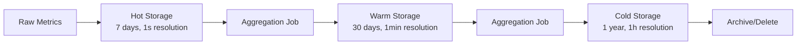

# Time-Series Data Model

## Overview

The monitoring system uses a time-series data model optimized for high-volume metric ingestion and efficient querying across multiple time ranges.

## Core Data Structure

### Metric Point

```json
{
  "metric_name": "string",
  "timestamp": "unix_timestamp_milliseconds",
  "value": "float64",
  "labels": {
    "key1": "value1",
    "key2": "value2"
  }
}
```

### Example Metrics

```json
[
  {
    "metric_name": "cpu_usage_percent",
    "timestamp": 1672531200000,
    "value": 75.5,
    "labels": {
      "host": "web-server-01",
      "region": "us-east-1",
      "environment": "production",
      "service": "web-api",
      "pool": "pool-001"
    }
  },
  {
    "metric_name": "memory_usage_bytes",
    "timestamp": 1672531200000,
    "value": 8589934592,
    "labels": {
      "host": "web-server-01",
      "region": "us-east-1",
      "environment": "production",
      "service": "web-api",
      "pool": "pool-001"
    }
  },
  {
    "metric_name": "http_requests_per_second",
    "timestamp": 1672531200000,
    "value": 1250.75,
    "labels": {
      "host": "web-server-01",
      "region": "us-east-1",
      "environment": "production",
      "service": "web-api",
      "pool": "pool-001",
      "endpoint": "/api/users",
      "status_code": "200"
    }
  }
]
```

## Label Design Principles

### Low Cardinality Requirements

Labels should have a limited set of unique values to prevent index explosion:

**Good Labels (Low Cardinality)**
- `environment`: [production, staging, development]
- `region`: [us-east-1, us-west-2, eu-west-1]
- `service`: [web-api, user-service, payment-service]
- `pool`: [pool-001, pool-002, ..., pool-1000]

**Avoid High Cardinality Labels**
- User IDs (millions of unique values)
- Request IDs (unlimited unique values)
- Timestamps as labels
- Session tokens

### Standard Label Schema

```yaml
# Infrastructure Labels
host: "server-identifier"
region: "aws-region-or-datacenter"
availability_zone: "az-identifier"
environment: "production|staging|development"

# Service Labels
service: "service-name"
version: "service-version"
pool: "server-pool-identifier"

# Application Labels
endpoint: "api-endpoint-path"
status_code: "http-status-code"
method: "http-method"

# Business Labels
team: "owning-team"
cost_center: "billing-identifier"
```

## Metric Naming Conventions

### Standard Naming Pattern

```
<namespace>_<subsystem>_<metric_name>_<unit>
```

### Examples

```
# OS Metrics
os_cpu_usage_percent
os_memory_usage_bytes
os_disk_usage_bytes
os_network_bytes_transmitted
os_network_bytes_received

# Application Metrics
app_http_requests_total
app_http_request_duration_seconds
app_database_connections_active
app_cache_hits_total
app_errors_total

# Business Metrics
business_active_users_count
business_revenue_dollars
business_orders_total
```

## Storage Schema

### Hot Storage (7 days)

```sql
-- Time-series table for high-frequency data
CREATE TABLE metrics_hot (
    metric_name VARCHAR(255) NOT NULL,
    timestamp TIMESTAMP NOT NULL,
    value DOUBLE NOT NULL,
    labels JSONB NOT NULL,
    INDEX idx_metric_time (metric_name, timestamp),
    INDEX idx_labels (labels) USING GIN
) PARTITION BY RANGE (timestamp);
```

### Warm Storage (30 days)

```sql
-- Aggregated 1-minute intervals
CREATE TABLE metrics_warm (
    metric_name VARCHAR(255) NOT NULL,
    timestamp TIMESTAMP NOT NULL,
    min_value DOUBLE NOT NULL,
    max_value DOUBLE NOT NULL,
    avg_value DOUBLE NOT NULL,
    sum_value DOUBLE NOT NULL,
    count_value BIGINT NOT NULL,
    labels JSONB NOT NULL,
    INDEX idx_metric_time (metric_name, timestamp),
    INDEX idx_labels (labels) USING GIN
) PARTITION BY RANGE (timestamp);
```

### Cold Storage (1 year)

```sql
-- Aggregated 1-hour intervals
CREATE TABLE metrics_cold (
    metric_name VARCHAR(255) NOT NULL,
    timestamp TIMESTAMP NOT NULL,
    min_value DOUBLE NOT NULL,
    max_value DOUBLE NOT NULL,
    avg_value DOUBLE NOT NULL,
    sum_value DOUBLE NOT NULL,
    count_value BIGINT NOT NULL,
    labels JSONB NOT NULL,
    INDEX idx_metric_time (metric_name, timestamp),
    INDEX idx_labels (labels) USING GIN
) PARTITION BY RANGE (timestamp);
```

## Query Patterns

### Common Query Types

1. **Time Range Queries**
   ```sql
   SELECT timestamp, value 
   FROM metrics_hot 
   WHERE metric_name = 'cpu_usage_percent' 
     AND timestamp BETWEEN '2024-01-01' AND '2024-01-02'
     AND labels->>'host' = 'web-server-01';
   ```

2. **Aggregation Queries**
   ```sql
   SELECT 
     DATE_TRUNC('minute', timestamp) as time_bucket,
     AVG(value) as avg_cpu
   FROM metrics_hot 
   WHERE metric_name = 'cpu_usage_percent' 
     AND timestamp > NOW() - INTERVAL '1 hour'
   GROUP BY time_bucket
   ORDER BY time_bucket;
   ```

3. **Multi-dimensional Queries**
   ```sql
   SELECT 
     labels->>'region' as region,
     AVG(value) as avg_cpu
   FROM metrics_hot 
   WHERE metric_name = 'cpu_usage_percent' 
     AND timestamp > NOW() - INTERVAL '5 minutes'
   GROUP BY labels->>'region';
   ```

## Data Lifecycle Management

### Retention Policies

```yaml
hot_storage:
  retention: 7 days
  resolution: 1 second
  storage_type: "in-memory + SSD"

warm_storage:
  retention: 30 days
  resolution: 1 minute
  storage_type: "SSD"
  aggregation:
    - min
    - max
    - avg
    - sum
    - count

cold_storage:
  retention: 1 year
  resolution: 1 hour
  storage_type: "object_storage"
  aggregation:
    - min
    - max
    - avg
    - sum
    - count
```

### Data Migration Process



## Optimization Strategies

### Compression

1. **Time Compression**: Delta encoding for timestamps
2. **Value Compression**: Double-delta encoding for values
3. **Label Compression**: Dictionary encoding for repeated labels

### Indexing

1. **Primary Index**: (metric_name, timestamp)
2. **Secondary Index**: Labels (GIN index for JSON queries)
3. **Composite Index**: (metric_name, timestamp, frequent_labels)

### Partitioning

1. **Time-based Partitioning**: Daily partitions for hot storage
2. **Metric-based Partitioning**: Separate high-volume metrics
3. **Hybrid Partitioning**: Time + metric for optimal query performance
