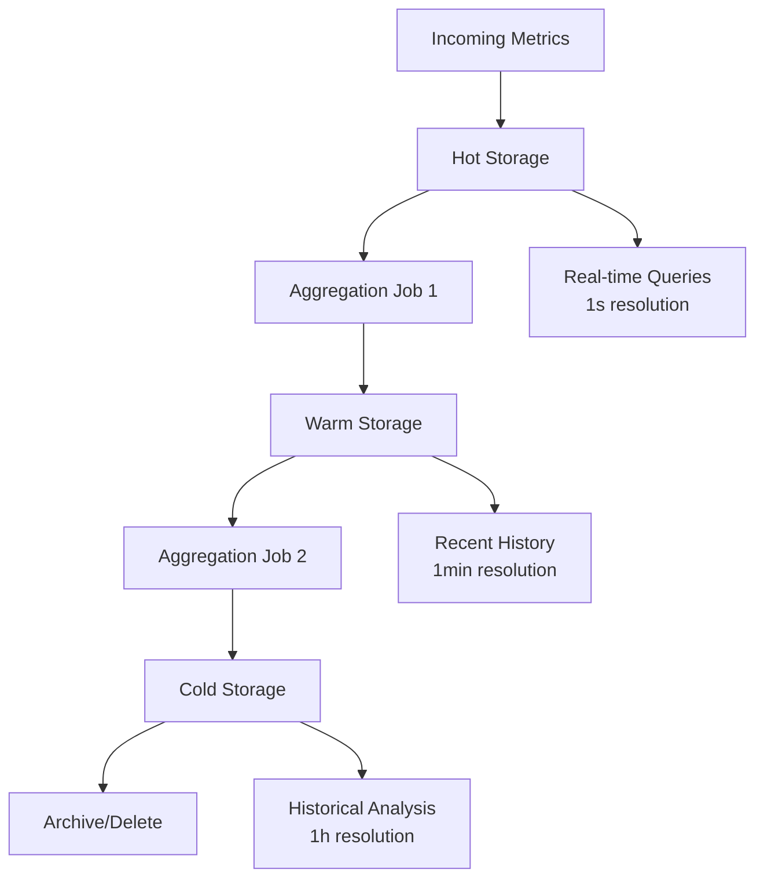

# Storage Strategy

## Overview

The monitoring system implements a multi-tier storage strategy to optimize for different access patterns, retention requirements, and cost considerations across hot, warm, and cold storage tiers.

## Storage Tier Architecture



## Hot Storage (7 days)

### Characteristics

- **Retention**: 7 days
- **Resolution**: 1-second intervals
- **Storage Type**: In-memory + SSD
- **Query Latency**: Sub-second
- **Use Cases**: Real-time monitoring, alerting, dashboards

### Storage Implementation

```yaml
# Hot storage configuration
hot_storage:
  technology: "Redis Cluster + TimeScaleDB"
  retention: "7 days"
  resolution: "1 second"
  
  redis_config:
    cluster_nodes: 6
    memory_per_node: "64GB"
    persistence: "RDB snapshots"
    eviction_policy: "allkeys-lru"
    
  timescaledb_config:
    chunk_time_interval: "1 hour"
    compression: true
    compression_after: "2 hours"
    
  performance:
    target_write_throughput: "1M points/sec"
    target_query_latency: "< 100ms"
    concurrent_queries: 1000
```

### Database Schema

```sql
-- Hot storage table with hypertable partitioning
CREATE TABLE metrics_hot (
    time TIMESTAMPTZ NOT NULL,
    metric_name TEXT NOT NULL,
    value DOUBLE PRECISION NOT NULL,
    labels JSONB NOT NULL,
    host TEXT NOT NULL,
    region TEXT NOT NULL,
    environment TEXT NOT NULL
);

-- Convert to hypertable for time-series optimization
SELECT create_hypertable('metrics_hot', 'time', chunk_time_interval => INTERVAL '1 hour');

-- Create indexes for common query patterns
CREATE INDEX idx_metrics_hot_name_time ON metrics_hot (metric_name, time DESC);
CREATE INDEX idx_metrics_hot_host_time ON metrics_hot (host, time DESC);
CREATE INDEX idx_metrics_hot_labels ON metrics_hot USING GIN (labels);

-- Enable compression for older chunks
ALTER TABLE metrics_hot SET (
    timescaledb.compress,
    timescaledb.compress_segmentby = 'metric_name, host',
    timescaledb.compress_orderby = 'time DESC'
);

-- Auto-compress chunks older than 2 hours
SELECT add_compression_policy('metrics_hot', INTERVAL '2 hours');

-- Auto-drop chunks older than 7 days
SELECT add_retention_policy('metrics_hot', INTERVAL '7 days');
```

### Write Optimization

```python
# Optimized batch writer for hot storage
import asyncpg
import asyncio
import json
from typing import List, Dict

class HotStorageWriter:
    def __init__(self, connection_pool):
        self.pool = connection_pool
        
    async def write_metrics_batch(self, metrics: List[Dict]):
        """Write metrics in optimized batches"""
        
        # Prepare batch insert data
        insert_data = []
        for metric in metrics:
            insert_data.append((
                metric['timestamp'],
                metric['metric_name'],
                metric['value'],
                json.dumps(metric['labels']),
                metric['labels'].get('host'),
                metric['labels'].get('region'),
                metric['labels'].get('environment')
            ))
        
        # Use COPY for maximum throughput
        async with self.pool.acquire() as conn:
            await conn.copy_records_to_table(
                'metrics_hot',
                records=insert_data,
                columns=['time', 'metric_name', 'value', 'labels', 'host', 'region', 'environment']
            )

    async def write_with_redis_cache(self, metrics: List[Dict]):
        """Write to both TimescaleDB and Redis for ultra-fast access"""
        import redis.asyncio as redis
        
        redis_client = redis.Redis(host='redis-cluster')
        
        # Write to TimescaleDB
        await self.write_metrics_batch(metrics)
        
        # Cache latest values in Redis for instant access
        pipe = redis_client.pipeline()
        for metric in metrics:
            cache_key = f"latest:{metric['metric_name']}:{hash(str(metric['labels']))}"
            cache_value = {
                'value': metric['value'],
                'timestamp': metric['timestamp'],
                'labels': metric['labels']
            }
            pipe.setex(cache_key, 300, json.dumps(cache_value))  # 5-minute TTL
        
        await pipe.execute()
```

## Warm Storage (30 days)

### Characteristics

- **Retention**: 30 days
- **Resolution**: 1-minute aggregated intervals
- **Storage Type**: SSD
- **Query Latency**: 1-2 seconds
- **Use Cases**: Recent historical analysis, capacity planning

### Aggregation Strategy

```yaml
# Warm storage configuration
warm_storage:
  technology: "ClickHouse"
  retention: "30 days"
  resolution: "1 minute aggregated"
  
  aggregation_functions:
    - min
    - max
    - avg
    - sum
    - count
    - p50
    - p95
    - p99
    
  clickhouse_config:
    shards: 3
    replicas: 2
    compression: "ZSTD(3)"
    merge_tree_settings:
      index_granularity: 8192
      parts_to_delay_insert: 150
```

### Aggregation Job

```python
# Aggregation job for warm storage
import asyncio
import asyncpg
from datetime import datetime, timedelta
import clickhouse_connect

class WarmStorageAggregator:
    def __init__(self, hot_storage_pool, clickhouse_client):
        self.hot_pool = hot_storage_pool
        self.clickhouse = clickhouse_client
        
    async def aggregate_to_warm_storage(self, start_time: datetime, end_time: datetime):
        """Aggregate hot storage data to warm storage"""
        
        aggregation_query = """
        SELECT 
            date_trunc('minute', time) as time_bucket,
            metric_name,
            labels,
            host,
            region,
            environment,
            MIN(value) as min_value,
            MAX(value) as max_value,
            AVG(value) as avg_value,
            SUM(value) as sum_value,
            COUNT(*) as count_value,
            quantile(0.50)(value) as p50_value,
            quantile(0.95)(value) as p95_value,
            quantile(0.99)(value) as p99_value
        FROM metrics_hot
        WHERE time >= $1 AND time < $2
        GROUP BY time_bucket, metric_name, labels, host, region, environment
        ORDER BY time_bucket
        """
        
        async with self.hot_pool.acquire() as conn:
            rows = await conn.fetch(aggregation_query, start_time, end_time)
            
        # Prepare data for ClickHouse insertion
        warm_data = []
        for row in rows:
            warm_data.append([
                row['time_bucket'],
                row['metric_name'],
                row['labels'],
                row['host'],
                row['region'],
                row['environment'],
                row['min_value'],
                row['max_value'],
                row['avg_value'],
                row['sum_value'],
                row['count_value'],
                row['p50_value'],
                row['p95_value'],
                row['p99_value']
            ])
        
        # Insert into ClickHouse
        if warm_data:
            self.clickhouse.insert(
                'metrics_warm',
                warm_data,
                column_names=[
                    'time', 'metric_name', 'labels', 'host', 'region', 'environment',
                    'min_value', 'max_value', 'avg_value', 'sum_value', 'count_value',
                    'p50_value', 'p95_value', 'p99_value'
                ]
            )
            
        print(f"Aggregated {len(warm_data)} minute-level data points")

    async def run_continuous_aggregation(self):
        """Run continuous aggregation from hot to warm storage"""
        while True:
            try:
                # Aggregate data that's 5 minutes old to allow for late arrivals
                end_time = datetime.utcnow() - timedelta(minutes=5)
                start_time = end_time - timedelta(minutes=1)
                
                await self.aggregate_to_warm_storage(start_time, end_time)
                
                # Wait 1 minute before next aggregation
                await asyncio.sleep(60)
                
            except Exception as e:
                print(f"Aggregation error: {e}")
                await asyncio.sleep(60)
```

### ClickHouse Schema

```sql
-- Warm storage table in ClickHouse
CREATE TABLE metrics_warm (
    time DateTime,
    metric_name LowCardinality(String),
    labels String,
    host LowCardinality(String),
    region LowCardinality(String),
    environment LowCardinality(String),
    min_value Float64,
    max_value Float64,
    avg_value Float64,
    sum_value Float64,
    count_value UInt64,
    p50_value Float64,
    p95_value Float64,
    p99_value Float64
) ENGINE = MergeTree()
PARTITION BY toYYYYMM(time)
ORDER BY (metric_name, host, time)
SETTINGS index_granularity = 8192;

-- TTL for automatic data cleanup
ALTER TABLE metrics_warm MODIFY TTL time + INTERVAL 30 DAY;
```

## Cold Storage (1 year)

### Characteristics

- **Retention**: 1 year
- **Resolution**: 1-hour aggregated intervals
- **Storage Type**: Object storage (S3/GCS)
- **Query Latency**: 10-30 seconds
- **Use Cases**: Long-term analysis, compliance, historical reporting

### Cold Storage Implementation

```yaml
# Cold storage configuration
cold_storage:
  technology: "Parquet files on S3"
  retention: "1 year"
  resolution: "1 hour aggregated"
  
  s3_config:
    bucket: "metrics-cold-storage"
    storage_class: "STANDARD_IA"
    lifecycle_rules:
      - transition_to_glacier: "6 months"
      - delete_after: "1 year"
      
  compression: "SNAPPY"
  partitioning: "year/month/day/hour"
  
  query_engine: "Apache Drill"
  caching: "Redis for frequently accessed data"
```

### Cold Storage Writer

```python
# Cold storage aggregator and writer
import pandas as pd
import pyarrow as pa
import pyarrow.parquet as pq
import boto3
from datetime import datetime, timedelta

class ColdStorageWriter:
    def __init__(self, clickhouse_client, s3_bucket):
        self.clickhouse = clickhouse_client
        self.s3_bucket = s3_bucket
        self.s3_client = boto3.client('s3')
        
    def aggregate_to_cold_storage(self, date: datetime):
        """Aggregate warm storage data to hourly cold storage"""
        
        start_time = date.replace(minute=0, second=0, microsecond=0)
        end_time = start_time + timedelta(hours=1)
        
        # Query warm storage for hourly aggregation
        query = """
        SELECT 
            toStartOfHour(time) as time_bucket,
            metric_name,
            labels,
            host,
            region,
            environment,
            min(min_value) as min_value,
            max(max_value) as max_value,
            avg(avg_value) as avg_value,
            sum(sum_value) as sum_value,
            sum(count_value) as count_value,
            quantile(0.50)(avg_value) as p50_value,
            quantile(0.95)(avg_value) as p95_value,
            quantile(0.99)(avg_value) as p99_value
        FROM metrics_warm
        WHERE time >= '{start_time}' AND time < '{end_time}'
        GROUP BY time_bucket, metric_name, labels, host, region, environment
        ORDER BY time_bucket
        """.format(start_time=start_time, end_time=end_time)
        
        # Execute query and get results
        result = self.clickhouse.query_df(query)
        
        if not result.empty:
            # Convert to Parquet and upload to S3
            self.write_parquet_to_s3(result, start_time)
            
    def write_parquet_to_s3(self, df: pd.DataFrame, timestamp: datetime):
        """Write DataFrame as Parquet file to S3"""
        
        # Create partition path: year/month/day/hour
        partition_path = timestamp.strftime("year=%Y/month=%m/day=%d/hour=%H")
        file_key = f"{partition_path}/metrics_{timestamp.strftime('%Y%m%d_%H')}.parquet"
        
        # Convert to PyArrow table and write as Parquet
        table = pa.Table.from_pandas(df)
        
        # Write to temporary buffer
        import io
        buffer = io.BytesIO()
        pq.write_table(
            table, 
            buffer, 
            compression='snappy',
            use_dictionary=True,
            row_group_size=50000
        )
        
        # Upload to S3
        buffer.seek(0)
        self.s3_client.put_object(
            Bucket=self.s3_bucket,
            Key=file_key,
            Body=buffer.getvalue(),
            ContentType='application/octet-stream',
            StorageClass='STANDARD_IA'
        )
        
        print(f"Uploaded {len(df)} hourly data points to s3://{self.s3_bucket}/{file_key}")

    def query_cold_storage(self, metric_name: str, start_time: datetime, end_time: datetime):
        """Query cold storage using Apache Drill or Athena"""
        
        # Example using AWS Athena
        import boto3
        
        athena_client = boto3.client('athena')
        
        query = f"""
        SELECT 
            time_bucket,
            avg_value,
            min_value,
            max_value,
            p95_value
        FROM "metrics_db"."cold_storage_table"
        WHERE metric_name = '{metric_name}'
          AND time_bucket BETWEEN timestamp '{start_time}' AND timestamp '{end_time}'
        ORDER BY time_bucket
        """
        
        # Execute Athena query
        response = athena_client.start_query_execution(
            QueryString=query,
            QueryExecutionContext={'Database': 'metrics_db'},
            ResultConfiguration={'OutputLocation': 's3://athena-results-bucket/'}
        )
        
        # Return query execution ID for result retrieval
        return response['QueryExecutionId']
```

## Data Lifecycle Management

### Automated Lifecycle

```yaml
# Data lifecycle configuration
data_lifecycle:
  hot_to_warm:
    trigger: "age > 7 days"
    aggregation: "1-minute intervals"
    process: "continuous background job"
    
  warm_to_cold:
    trigger: "age > 30 days"
    aggregation: "1-hour intervals"
    process: "daily batch job"
    
  cold_archive:
    trigger: "age > 6 months"
    storage_class: "S3 Glacier"
    compression: "maximum"
    
  data_deletion:
    trigger: "age > 1 year"
    process: "automatic lifecycle policy"
```

### Lifecycle Management Service

```python
# Data lifecycle management service
import asyncio
from datetime import datetime, timedelta
import logging

class DataLifecycleManager:
    def __init__(self, hot_storage, warm_storage, cold_storage):
        self.hot_storage = hot_storage
        self.warm_storage = warm_storage
        self.cold_storage = cold_storage
        self.logger = logging.getLogger(__name__)
        
    async def run_lifecycle_management(self):
        """Run continuous data lifecycle management"""
        while True:
            try:
                await self.manage_hot_to_warm_transition()
                await self.manage_warm_to_cold_transition()
                await self.manage_cold_storage_cleanup()
                
                # Run every hour
                await asyncio.sleep(3600)
                
            except Exception as e:
                self.logger.error(f"Lifecycle management error: {e}")
                await asyncio.sleep(300)  # Retry in 5 minutes
                
    async def manage_hot_to_warm_transition(self):
        """Move data from hot to warm storage"""
        cutoff_time = datetime.utcnow() - timedelta(days=7)
        
        # Aggregate and move data older than 7 days
        await self.warm_storage.aggregate_from_hot_storage(cutoff_time)
        
        # Clean up old hot storage data
        await self.hot_storage.cleanup_old_data(cutoff_time)
        
    async def manage_warm_to_cold_transition(self):
        """Move data from warm to cold storage"""
        cutoff_time = datetime.utcnow() - timedelta(days=30)
        
        # Aggregate and move data older than 30 days
        await self.cold_storage.aggregate_from_warm_storage(cutoff_time)
        
        # Clean up old warm storage data
        await self.warm_storage.cleanup_old_data(cutoff_time)
        
    async def manage_cold_storage_cleanup(self):
        """Clean up old cold storage data"""
        cutoff_time = datetime.utcnow() - timedelta(days=365)
        
        # Delete data older than 1 year
        await self.cold_storage.delete_old_data(cutoff_time)
```

## Storage Optimization Techniques

### Compression Strategies

```yaml
# Compression configuration by storage tier
compression:
  hot_storage:
    timescaledb: "native compression"
    redis: "LZ4 for memory efficiency"
    
  warm_storage:
    clickhouse: "ZSTD(3) for balanced speed/ratio"
    
  cold_storage:
    parquet: "SNAPPY for query performance"
    archive: "GZIP for maximum compression"
```

### Indexing Strategy

```sql
-- Hot storage indexes
CREATE INDEX CONCURRENTLY idx_metrics_hot_recent 
ON metrics_hot (metric_name, time DESC) 
WHERE time > now() - interval '1 day';

-- Warm storage indexes
CREATE INDEX idx_metrics_warm_metric_time 
ON metrics_warm (metric_name, time);

CREATE INDEX idx_metrics_warm_host_time 
ON metrics_warm (host, time);

-- Partial indexes for high-traffic metrics
CREATE INDEX idx_metrics_warm_cpu_recent 
ON metrics_warm (time) 
WHERE metric_name = 'cpu_usage_percent';
```

### Query Optimization

```python
# Smart query router
class QueryRouter:
    def __init__(self, hot_storage, warm_storage, cold_storage):
        self.storages = {
            'hot': hot_storage,
            'warm': warm_storage,
            'cold': cold_storage
        }
        
    def route_query(self, metric_name: str, start_time: datetime, end_time: datetime):
        """Route query to appropriate storage tier"""
        
        now = datetime.utcnow()
        hot_threshold = now - timedelta(days=7)
        warm_threshold = now - timedelta(days=30)
        
        # Determine which storage tiers to query
        tiers_to_query = []
        
        if end_time > hot_threshold:
            tiers_to_query.append('hot')
            
        if start_time < hot_threshold and end_time > warm_threshold:
            tiers_to_query.append('warm')
            
        if start_time < warm_threshold:
            tiers_to_query.append('cold')
            
        return tiers_to_query
    
    async def execute_multi_tier_query(self, metric_name: str, start_time: datetime, end_time: datetime):
        """Execute query across multiple storage tiers and merge results"""
        
        tiers = self.route_query(metric_name, start_time, end_time)
        
        # Execute queries in parallel
        tasks = []
        for tier in tiers:
            task = self.storages[tier].query(metric_name, start_time, end_time)
            tasks.append(task)
            
        results = await asyncio.gather(*tasks)
        
        # Merge and sort results by timestamp
        merged_results = []
        for result in results:
            merged_results.extend(result)
            
        return sorted(merged_results, key=lambda x: x['timestamp'])
```

## Performance Monitoring

### Storage Metrics

```yaml
# Key storage performance metrics
storage_metrics:
  hot_storage:
    - write_throughput_per_second
    - query_latency_p95
    - memory_usage_percent
    - disk_usage_percent
    - compression_ratio
    
  warm_storage:
    - aggregation_lag_minutes
    - query_latency_p95
    - disk_usage_percent
    - merge_performance
    
  cold_storage:
    - s3_upload_latency
    - query_latency_p95
    - storage_cost_per_tb
    - lifecycle_transition_lag
```

This storage strategy provides a scalable, cost-effective solution for handling the monitoring system's data requirements while maintaining query performance across different time ranges and use cases.
