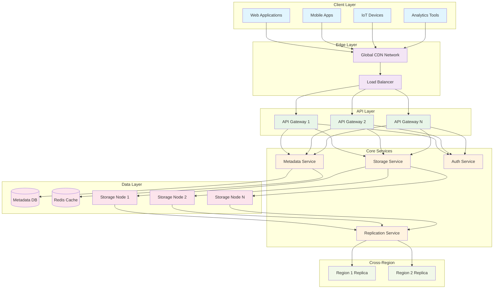
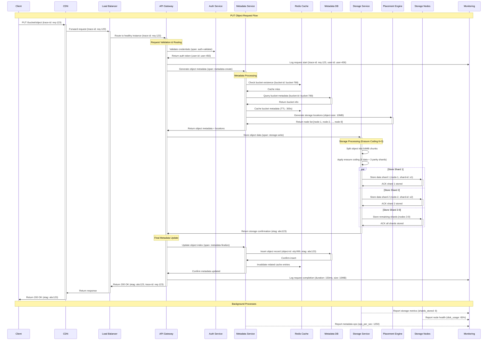
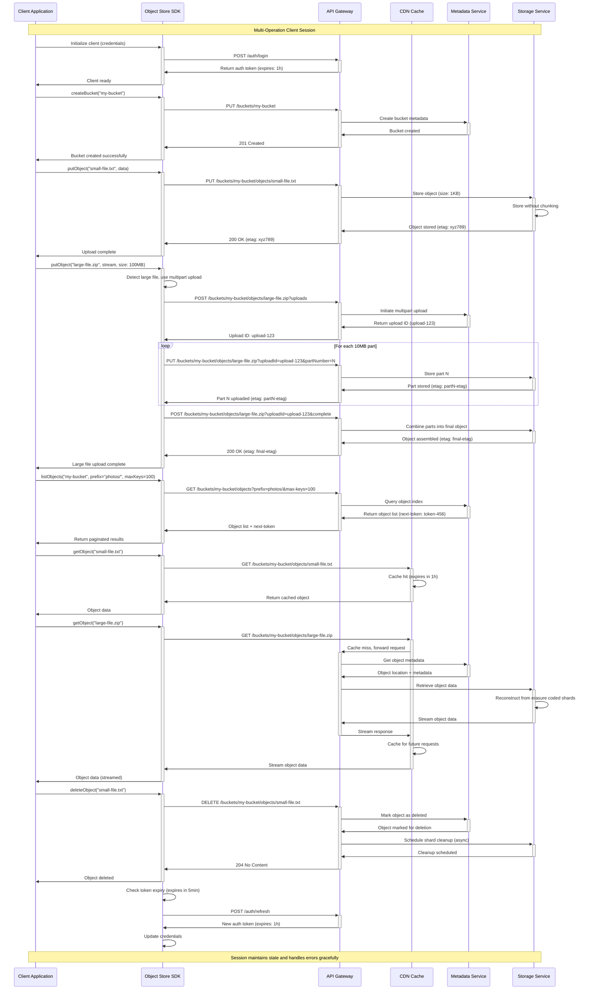

# Architecture Overview

This document provides a comprehensive architectural overview of the distributed object store system through various perspectives, from high-level system design to detailed interaction flows.

## Table of Contents
1. [High-Level System Architecture](#high-level-system-architecture)
2. [Logical Services Breakdown](#logical-services-breakdown)
3. [Physical Services Layout](#physical-services-layout)
4. [Detailed System Diagram with Request Tracing](#detailed-system-diagram-with-request-tracing)
5. [Client Interaction Sequence](#client-interaction-sequence)
6. [Data Flow Patterns](#data-flow-patterns)
7. [Deployment Architecture](#deployment-architecture)

---

## High-Level System Architecture

The distributed object store follows a layered microservices architecture designed for high availability, durability, and scalability. The system can handle petabyte-scale storage with millions of concurrent requests.

**Key Characteristics:**
- **Durability**: 99.9999% through 6+3 erasure coding and cross-region replication
- **Availability**: 99.99% with multi-zone deployment and automatic failover
- **Scalability**: Horizontal scaling of all components with consistent hashing
- **Performance**: Sub-100ms latency for small objects, 10GB/s+ aggregate throughput

---

## Logical Services Breakdown

This diagram shows the functional decomposition of services and their responsibilities within the system.

```mermaid
graph TD
    subgraph "Frontend Services"
        subgraph "API Gateway Cluster"
            AG[API Gateway]
            Auth[Authentication]
            RateLimit[Rate Limiter]
            Router[Request Router]
            Validator[Request Validator]
        end
        
        subgraph "Load Balancing"
            GLB[Global Load Balancer]
            RLB[Regional Load Balancer]
            HCheck[Health Checker]
        end
    end
    
    subgraph "Core Business Logic"
        subgraph "Metadata Management"
            MS[Metadata Service]
            ObjectIndex[Object Indexer]
            BucketManager[Bucket Manager]
            VersionManager[Version Manager]
            LifecycleManager[Lifecycle Manager]
        end
        
        subgraph "Storage Management"
            SS[Storage Service]
            PlacementEngine[Placement Engine]
            ErasureEncoder[Erasure Encoder]
            ChunkManager[Chunk Manager]
            CompressionEngine[Compression Engine]
        end
        
        subgraph "Data Consistency"
            ReplicationService[Replication Service]
            ConsistencyManager[Consistency Manager]
            ConflictResolver[Conflict Resolver]
            SyncOrchestrator[Sync Orchestrator]
        end
    end
    
    subgraph "Infrastructure Services"
        subgraph "Storage Backend"
            StorageNodes[Storage Node Pool]
            HealthMonitor[Node Health Monitor]
            CapacityManager[Capacity Manager]
            RepairService[Auto Repair Service]
        end
        
        subgraph "Data Persistence"
            MetadataDB[(Metadata Database)]
            CacheLayer[(Cache Layer)]
            SearchIndex[(Search Index)]
            AuditLog[(Audit Logs)]
        end
        
        subgraph "Cross-Regional"
            CrossRegionSync[Cross-Region Sync]
            DisasterRecovery[Disaster Recovery]
            BackupOrchestrator[Backup Orchestrator]
        end
    end
    
    subgraph "Supporting Services"
        subgraph "Observability"
            MetricsCollector[Metrics Collector]
            LogAggregator[Log Aggregator]
            AlertManager[Alert Manager]
            HealthDashboard[Health Dashboard]
        end
        
        subgraph "Security"
            KeyManager[Key Manager]
            EncryptionService[Encryption Service]
            AccessControl[Access Control]
            ThreatDetection[Threat Detection]
        end
        
        subgraph "Operations"
            ConfigManager[Config Manager]
            DeploymentManager[Deployment Manager]
            ScalingController[Auto Scaler]
            MaintenanceScheduler[Maintenance Scheduler]
        end
    end
    
    %% Service Dependencies
    AG --> Auth & RateLimit & Router & Validator
    GLB --> RLB --> AG
    
    MS --> ObjectIndex & BucketManager & VersionManager & LifecycleManager
    SS --> PlacementEngine & ErasureEncoder & ChunkManager & CompressionEngine
    
    MS --> MetadataDB & CacheLayer & SearchIndex
    SS --> StorageNodes
    
    ReplicationService --> CrossRegionSync
    StorageNodes --> HealthMonitor & RepairService
    
    classDef frontend fill:#e3f2fd
    classDef core fill:#e8f5e8
    classDef infra fill:#fff3e0
    classDef support fill:#f3e5f5
    
    class AG,Auth,RateLimit,Router,Validator,GLB,RLB,HCheck frontend
    class MS,ObjectIndex,BucketManager,VersionManager,LifecycleManager,SS,PlacementEngine,ErasureEncoder,ChunkManager,CompressionEngine,ReplicationService,ConsistencyManager,ConflictResolver,SyncOrchestrator core
    class StorageNodes,HealthMonitor,CapacityManager,RepairService,MetadataDB,CacheLayer,SearchIndex,AuditLog,CrossRegionSync,DisasterRecovery,BackupOrchestrator infra
    class MetricsCollector,LogAggregator,AlertManager,HealthDashboard,KeyManager,EncryptionService,AccessControl,ThreatDetection,ConfigManager,DeploymentManager,ScalingController,MaintenanceScheduler support
```

**Service Responsibilities:**

- **Frontend Services**: Request handling, authentication, rate limiting, and routing
- **Core Business Logic**: Object and metadata management, storage coordination, consistency
- **Infrastructure Services**: Physical storage, persistence, cross-region coordination
- **Supporting Services**: Monitoring, security, and operational management

---

## Physical Services Layout

This diagram illustrates the physical deployment architecture across multiple regions and availability zones.

```mermaid
graph TB
    subgraph "Global Infrastructure"
        subgraph "Region US-West"
            subgraph "AZ us-west-1a"
                ALB1[Application LB]
                AG1[API Gateway Pod]
                MS1[Metadata Service Pod]
                SS1[Storage Service Pod]
                SN1[Storage Node 1]
                SN2[Storage Node 2]
                SN3[Storage Node 3]
            end
            
            subgraph "AZ us-west-1b"
                AG2[API Gateway Pod]
                MS2[Metadata Service Pod]
                SS2[Storage Service Pod]
                SN4[Storage Node 4]
                SN5[Storage Node 5]
                SN6[Storage Node 6]
            end
            
            subgraph "AZ us-west-1c"
                AG3[API Gateway Pod]
                MS3[Metadata Service Pod]
                SS3[Storage Service Pod]
                SN7[Storage Node 7]
                SN8[Storage Node 8]
                SN9[Storage Node 9]
            end
            
            subgraph "Shared Services"
                RDS[(RDS Cluster)]
                ElastiCache[(ElastiCache)]
                NLB[Network LB]
            end
        end
        
        subgraph "Region EU-Central"
            subgraph "AZ eu-central-1a"
                AG4[API Gateway Pod]
                MS4[Metadata Service Pod]
                SS4[Storage Service Pod]
                SN10[Storage Node 10]
                SN11[Storage Node 11]
                SN12[Storage Node 12]
            end
            
            subgraph "AZ eu-central-1b"
                AG5[API Gateway Pod]
                MS5[Metadata Service Pod]
                SS5[Storage Service Pod]
                SN13[Storage Node 13]
                SN14[Storage Node 14]
                SN15[Storage Node 15]
            end
            
            subgraph "Shared Services EU"
                RDS2[(RDS Cluster)]
                ElastiCache2[(ElastiCache)]
                NLB2[Network LB]
            end
        end
        
        subgraph "Global Services"
            R53[Route 53]
            CloudFront[CloudFront CDN]
            DirectConnect[Direct Connect]
        end
    end
    
    subgraph "Network Topology"
        Internet[Internet]
        VPC1[VPC us-west]
        VPC2[VPC eu-central]
        Transit[Transit Gateway]
    end
    
    %% Global routing
    Internet --> R53
    R53 --> CloudFront
    CloudFront --> ALB1
    CloudFront --> NLB2
    
    %% Regional connectivity
    VPC1 --> Transit
    VPC2 --> Transit
    ALB1 --> AG1 & AG2 & AG3
    NLB2 --> AG4 & AG5
    
    %% Service mesh within AZ
    AG1 --> MS1 --> SS1
    AG2 --> MS2 --> SS2
    AG3 --> MS3 --> SS3
    AG4 --> MS4 --> SS4
    AG5 --> MS5 --> SS5
    
    %% Storage placement (6+3 erasure coding)
    SS1 --> SN1 & SN2 & SN3 & SN4 & SN5 & SN6 & SN7 & SN8 & SN9
    SS4 --> SN10 & SN11 & SN12 & SN13 & SN14 & SN15
    
    %% Shared services
    MS1 & MS2 & MS3 --> RDS
    MS4 & MS5 --> RDS2
    AG1 & AG2 & AG3 --> ElastiCache
    AG4 & AG5 --> ElastiCache2
    
    %% Cross-region replication
    SN1 -.-> SN10
    SN2 -.-> SN11
    SN3 -.-> SN12
    
    classDef az1 fill:#e3f2fd
    classDef az2 fill:#e8f5e8
    classDef az3 fill:#fff3e0
    classDef shared fill:#f3e5f5
    classDef global fill:#fce4ec
    classDef network fill:#f1f8e9
    
    class AG1,MS1,SS1,SN1,SN2,SN3 az1
    class AG2,MS2,SS2,SN4,SN5,SN6,AG4,MS4,SS4,SN10,SN11,SN12 az2
    class AG3,MS3,SS3,SN7,SN8,SN9,AG5,MS5,SS5,SN13,SN14,SN15 az3
    class RDS,ElastiCache,NLB,RDS2,ElastiCache2,NLB2 shared
    class R53,CloudFront,DirectConnect global
    class Internet,VPC1,VPC2,Transit,ALB1 network
```

**Physical Architecture Features:**

- **Multi-Region**: Primary (US-West) and secondary (EU-Central) regions
- **Multi-AZ**: 3 availability zones per region for fault tolerance
- **Erasure Coding**: 6+3 configuration spreads data across 9 storage nodes
- **Cross-Region Replication**: Automatic data synchronization between regions
- **Shared Services**: RDS and ElastiCache clusters for metadata and caching

---

## Detailed System Diagram with Request Tracing

This diagram shows the detailed request flow through the system components with tracing information.

**Request Flow Details:**

1. **Request Ingestion**: CDN → Load Balancer → API Gateway with distributed tracing
2. **Authentication**: Token validation and user identification
3. **Metadata Processing**: Bucket validation, object ID generation, storage location planning
4. **Storage Operations**: Erasure coding and parallel shard distribution
5. **Metadata Finalization**: Object indexing and cache management
6. **Response**: Success confirmation with ETag and tracing information

---

## Client Interaction Sequence

This sequence diagram illustrates typical client interaction patterns with the object store.

**Client Interaction Patterns:**

- **Authentication**: JWT token-based with automatic refresh
- **Small Objects**: Direct upload without chunking
- **Large Objects**: Automatic multipart upload with configurable part size
- **Listing**: Paginated responses with continuation tokens
- **Caching**: CDN integration for improved read performance
- **Error Handling**: Automatic retries and exponential backoff

---

## Data Flow Patterns

This diagram illustrates the major data flow patterns within the system.

```mermaid
flowchart TD
    subgraph "Write Path"
        W1[Client Write Request] --> W2[API Gateway]
        W2 --> W3[Authentication]
        W2 --> W4[Request Validation]
        W4 --> W5[Metadata Service]
        W5 --> W6[Generate Object ID]
        W5 --> W7[Storage Location Planning]
        W7 --> W8[Placement Engine]
        W8 --> W9[Consistent Hashing]
        W9 --> W10[Storage Service]
        W10 --> W11[Erasure Coding]
        W11 --> W12[Parallel Shard Storage]
        W12 --> W13[Metadata Finalization]
        W13 --> W14[Cache Update]
        W14 --> W15[Success Response]
    end
    
    subgraph "Read Path"
        R1[Client Read Request] --> R2[CDN Check]
        R2 --> R3{Cache Hit?}
        R3 -->|Yes| R4[Return Cached Data]
        R3 -->|No| R5[API Gateway]
        R5 --> R6[Metadata Service]
        R6 --> R7[Object Location Lookup]
        R7 --> R8[Storage Service]
        R8 --> R9[Shard Retrieval]
        R9 --> R10[Erasure Decode]
        R10 --> R11[Data Reconstruction]
        R11 --> R12[Stream to Client]
        R12 --> R13[Update CDN Cache]
    end
    
    subgraph "Replication Flow"
        REP1[Primary Storage] --> REP2[Replication Service]
        REP2 --> REP3[Cross-Region Transfer]
        REP3 --> REP4[Secondary Region Storage]
        REP4 --> REP5[Consistency Verification]
        REP5 --> REP6[Replication Confirmation]
    end
    
    subgraph "Maintenance Flow"
        M1[Health Monitor] --> M2[Node Status Check]
        M2 --> M3{Node Failed?}
        M3 -->|Yes| M4[Trigger Repair]
        M3 -->|No| M5[Continue Monitoring]
        M4 --> M6[Identify Missing Shards]
        M6 --> M7[Reconstruct from Parity]
        M7 --> M8[Store on Healthy Node]
        M8 --> M9[Update Metadata]
        M9 --> M5
    end
    
    subgraph "Lifecycle Management"
        L1[Lifecycle Policy] --> L2[Object Age Check]
        L2 --> L3{Action Required?}
        L3 -->|Delete| L4[Mark for Deletion]
        L3 -->|Tier| L5[Move to Cold Storage]
        L3 -->|None| L6[Continue Monitoring]
        L4 --> L7[Schedule Cleanup]
        L5 --> L8[Migrate Data]
        L7 --> L9[Free Storage Space]
        L8 --> L10[Update Storage Class]
    end
    
    classDef write fill:#e8f5e8
    classDef read fill:#e3f2fd
    classDef replication fill:#fff3e0
    classDef maintenance fill:#f3e5f5
    classDef lifecycle fill:#fce4ec
    
    class W1,W2,W3,W4,W5,W6,W7,W8,W9,W10,W11,W12,W13,W14,W15 write
    class R1,R2,R3,R4,R5,R6,R7,R8,R9,R10,R11,R12,R13 read
    class REP1,REP2,REP3,REP4,REP5,REP6 replication
    class M1,M2,M3,M4,M5,M6,M7,M8,M9 maintenance
    class L1,L2,L3,L4,L5,L6,L7,L8,L9,L10 lifecycle
```

**Data Flow Characteristics:**

- **Write Path**: Multi-stage process with erasure coding and parallel storage
- **Read Path**: CDN-optimized with fallback to storage reconstruction
- **Replication Flow**: Asynchronous cross-region data synchronization
- **Maintenance Flow**: Automated failure detection and self-healing
- **Lifecycle Management**: Policy-driven data tiering and cleanup

---

## Deployment Architecture

This diagram shows the Kubernetes-based deployment architecture with auto-scaling and service mesh.

```mermaid
graph TB
    subgraph "Kubernetes Cluster (us-west-1)"
        subgraph "System Namespaces"
            subgraph "kube-system"
                DNS[CoreDNS]
                CNI[Calico CNI]
                CSI[EBS CSI Driver]
            end
            
            subgraph "monitoring"
                Prometheus[Prometheus]
                Grafana[Grafana]
                AlertManager[AlertManager]
            end
            
            subgraph "istio-system"
                IstioGW[Istio Gateway]
                IstioPilot[Pilot]
                IstioMixer[Mixer]
            end
        end
        
        subgraph "Application Namespaces"
            subgraph "objectstore-api"
                subgraph "API Gateway Deployment"
                    AG1[api-gateway-pod-1]
                    AG2[api-gateway-pod-2]
                    AG3[api-gateway-pod-3]
                    AGHPA[HPA: 3-20 replicas]
                end
                
                AGService[api-gateway-service]
                AGIngress[api-gateway-ingress]
            end
            
            subgraph "objectstore-metadata"
                subgraph "Metadata Service Deployment"
                    MS1[metadata-svc-pod-1]
                    MS2[metadata-svc-pod-2]
                    MS3[metadata-svc-pod-3]
                    MSHPA[HPA: 3-10 replicas]
                end
                
                MSService[metadata-service]
                MSConfigMap[metadata-config]
                MSSecret[db-credentials]
            end
            
            subgraph "objectstore-storage"
                subgraph "Storage Service Deployment"
                    SS1[storage-svc-pod-1]
                    SS2[storage-svc-pod-2]
                    SS3[storage-svc-pod-3]
                    SSHPA[HPA: 3-15 replicas]
                end
                
                SSService[storage-service]
                SSStatefulSet[Storage Nodes StatefulSet]
                
                subgraph "Storage Nodes"
                    SN1[storage-node-0]
                    SN2[storage-node-1]
                    SN3[storage-node-2]
                    SNn[storage-node-N]
                end
            end
        end
        
        subgraph "Persistent Storage"
            PVC1[PVC: metadata-cache]
            PVC2[PVC: storage-data-0]
            PVC3[PVC: storage-data-1]
            PVCn[PVC: storage-data-N]
        end
    end
    
    subgraph "External Dependencies"
        subgraph "AWS Managed Services"
            ALB[Application Load Balancer]
            RDS[RDS PostgreSQL Cluster]
            ElastiCache[ElastiCache Redis]
            S3[S3 Backup Storage]
            IAM[IAM Roles & Policies]
        end
        
        subgraph "Networking"
            VPC[VPC: 10.0.0.0/16]
            IGW[Internet Gateway]
            NAT[NAT Gateway]
            RT[Route Tables]
        end
    end
    
    %% Traffic Flow
    Internet --> ALB
    ALB --> AGIngress
    AGIngress --> IstioGW
    IstioGW --> AGService
    AGService --> AG1 & AG2 & AG3
    
    %% Service Communication
    AG1 & AG2 & AG3 --> MSService
    MSService --> MS1 & MS2 & MS3
    MS1 & MS2 & MS3 --> RDS
    MS1 & MS2 & MS3 --> ElastiCache
    
    AG1 & AG2 & AG3 --> SSService
    SSService --> SS1 & SS2 & SS3
    SS1 & SS2 & SS3 --> SN1 & SN2 & SN3 & SNn
    
    %% Storage
    SN1 --> PVC2
    SN2 --> PVC3
    SNn --> PVCn
    MS1 & MS2 & MS3 --> PVC1
    
    %% Monitoring
    AG1 & AG2 & AG3 --> Prometheus
    MS1 & MS2 & MS3 --> Prometheus
    SS1 & SS2 & SS3 --> Prometheus
    SN1 & SN2 & SN3 & SNn --> Prometheus
    
    %% Auto-scaling
    AGHPA -.-> AG1 & AG2 & AG3
    MSHPA -.-> MS1 & MS2 & MS3
    SSHPA -.-> SS1 & SS2 & SS3
    
    %% Backup
    RDS -.-> S3
    SN1 & SN2 & SN3 & SNn -.-> S3
    
    classDef system fill:#e1f5fe
    classDef app fill:#e8f5e8
    classDef storage fill:#fff3e0
    classDef external fill:#f3e5f5
    classDef network fill:#fce4ec
    
    class DNS,CNI,CSI,Prometheus,Grafana,AlertManager,IstioGW,IstioPilot,IstioMixer system
    class AG1,AG2,AG3,MS1,MS2,MS3,SS1,SS2,SS3,SN1,SN2,SN3,SNn,AGService,MSService,SSService app
    class PVC1,PVC2,PVC3,PVCn,SSStatefulSet storage
    class ALB,RDS,ElastiCache,S3,IAM external
    class VPC,IGW,NAT,RT network
```

**Deployment Features:**

- **Microservices Architecture**: Separate deployments for API, metadata, and storage services
- **Auto-Scaling**: HPA for automatic pod scaling based on CPU/memory metrics
- **Service Mesh**: Istio for traffic management, security, and observability
- **Persistent Storage**: StatefulSets for storage nodes with persistent volumes
- **Monitoring**: Comprehensive observability stack with Prometheus and Grafana
- **High Availability**: Multi-replica deployments across availability zones

---

## Summary

This architectural overview demonstrates how the distributed object store achieves its design goals through:

1. **Layered Architecture**: Clean separation between API, business logic, and storage layers
2. **Microservices Design**: Independent, scalable services with clear responsibilities
3. **Physical Distribution**: Multi-region, multi-AZ deployment for fault tolerance
4. **Request Tracing**: End-to-end observability for debugging and optimization
5. **Client Integration**: SDK-based interaction with advanced features like multipart upload
6. **Data Flow Optimization**: Multiple specialized patterns for different use cases
7. **Cloud-Native Deployment**: Kubernetes-based with auto-scaling and service mesh

The system successfully balances durability (99.9999%), availability (99.99%), performance (sub-100ms), and scalability (petabyte-scale) through careful architectural choices and modern cloud-native technologies.
