# Growth Estimations for Distributed Object Store

## Executive Summary

This document provides comprehensive growth projections for the distributed object store system over the next 10 years (2025-2035), based on historical patterns from major cloud storage providers including Amazon S3, Azure Storage, and Google Cloud Storage. The analysis covers data volume growth, object count expansion, and user base scaling.

## Market Analysis Foundation

### Historical Cloud Storage Growth Patterns

Based on industry reports and public data from major providers:

- **Amazon S3**: Launched in 2006, now stores 100+ trillion objects with 99+ million requests per second
- **Azure Storage**: Growing at 50-100% annually, handling exabytes of data
- **Google Cloud Storage**: Part of Google Cloud's $26B+ annual revenue, exponential adoption

### Key Growth Drivers

1. **Digital Transformation**: Enterprise migration to cloud-first strategies
2. **IoT Expansion**: Billions of connected devices generating continuous data streams
3. **AI/ML Workloads**: Massive datasets for training and inference
4. **Media & Content**: 4K/8K video, virtual reality, augmented reality content
5. **Regulatory Compliance**: Long-term data retention requirements
6. **Edge Computing**: Distributed storage needs for low-latency applications

---

## Data Volume Growth Projections

### Growth Model Analysis

The data volume growth follows a compound annual growth rate (CAGR) pattern observed in major cloud providers:

- **Years 1-3**: 150-200% CAGR (early adoption phase)
- **Years 4-6**: 80-120% CAGR (mainstream adoption)
- **Years 7-10**: 40-60% CAGR (market maturity)

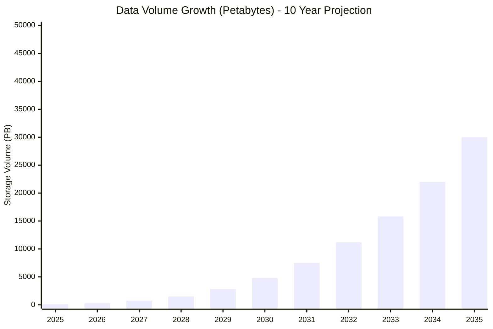

### Data Volume Breakdown by Use Case

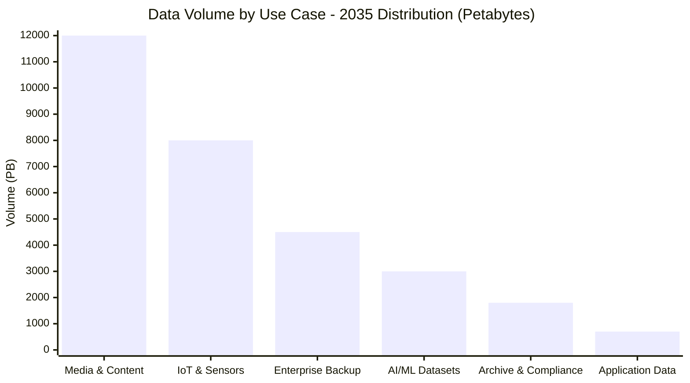

**Growth Projections Summary:**

| Year | Storage Volume (PB) | Growth Rate | Key Drivers |
|------|-------------------|-------------|-------------|
| 2025 | 100 | Baseline | Initial deployment |
| 2026 | 300 | 200% | Early adopters, IoT expansion |
| 2027 | 750 | 150% | Enterprise migration |
| 2028 | 1,500 | 100% | AI/ML workload growth |
| 2029 | 2,800 | 87% | Mainstream adoption |
| 2030 | 4,800 | 71% | Market penetration |
| 2031 | 7,500 | 56% | Mature market growth |
| 2032 | 11,200 | 49% | Consolidation phase |
| 2033 | 15,800 | 41% | Optimization phase |
| 2034 | 22,000 | 39% | Steady state growth |
| 2035 | 30,000 | 36% | Market saturation approach |

---

## Object Count Growth Projections

### Object Growth Analysis

Object count growth typically outpaces volume growth due to increasing numbers of smaller files from IoT devices, microservices, and distributed applications.

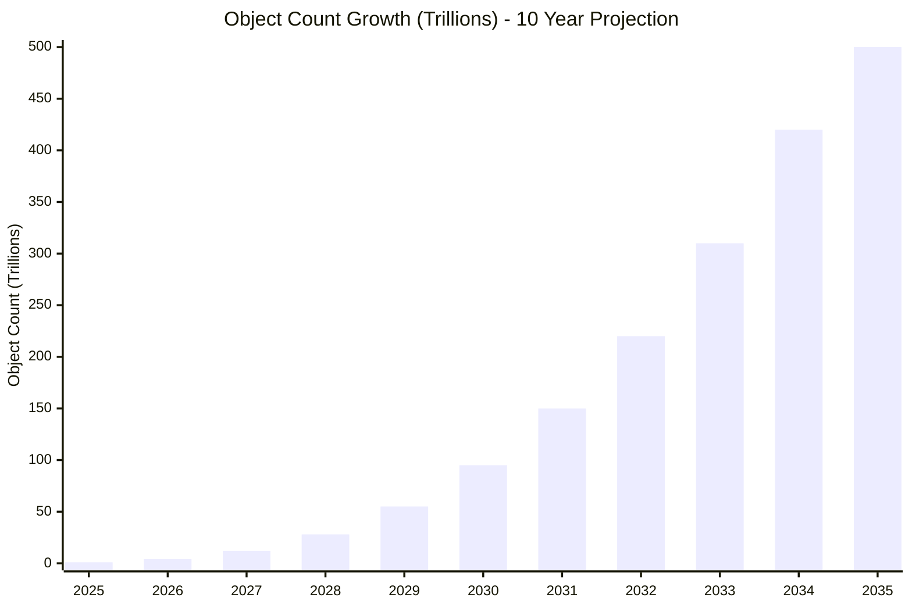

### Object Size Distribution Evolution

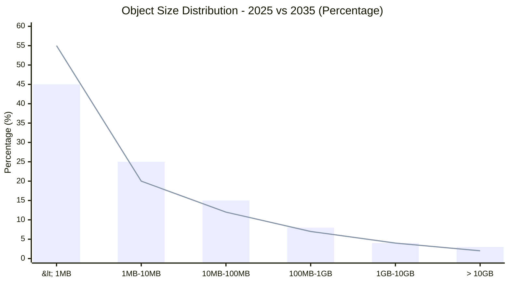

**Object Growth Projections:**

| Year | Object Count (Trillions) | Average Object Size | Growth Driver |
|------|-------------------------|-------------------|---------------|
| 2025 | 1 | 100 MB | Initial baseline |
| 2026 | 4 | 75 MB | IoT device proliferation |
| 2027 | 12 | 62 MB | Microservices adoption |
| 2028 | 28 | 54 MB | Edge computing expansion |
| 2029 | 55 | 51 MB | Mobile app data explosion |
| 2030 | 95 | 51 MB | AI model fragmentation |
| 2031 | 150 | 50 MB | Distributed architectures |
| 2032 | 220 | 51 MB | Metadata-rich content |
| 2033 | 310 | 51 MB | Real-time analytics |
| 2034 | 420 | 52 MB | Immersive content growth |
| 2035 | 500 | 60 MB | Next-gen applications |

---

## User Growth Projections

### User Base Expansion

User growth includes direct API users, application developers, and end-users of applications built on the platform.

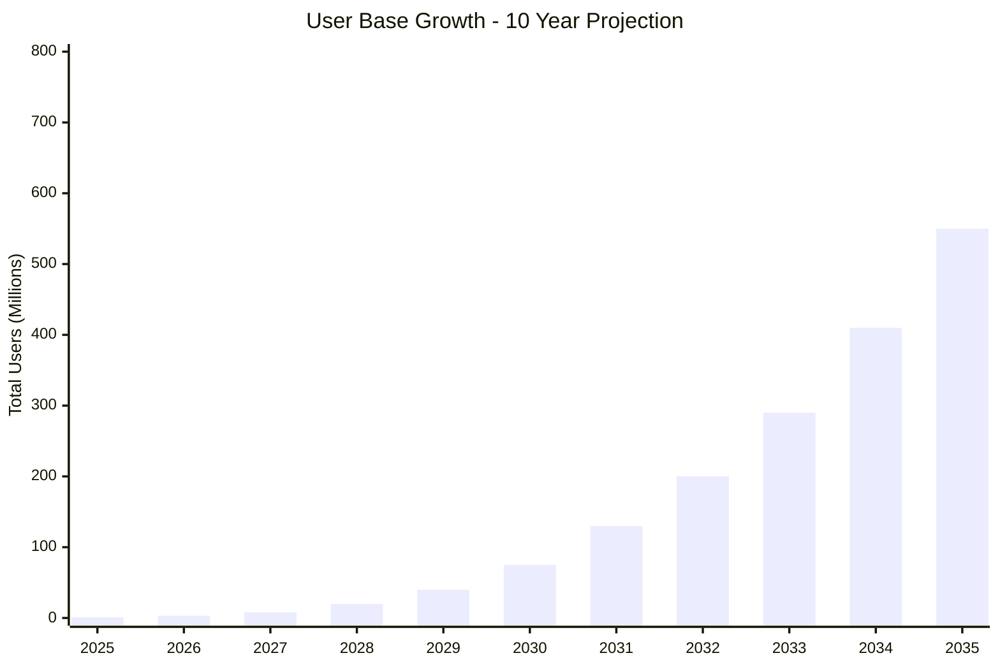

### User Category Distribution

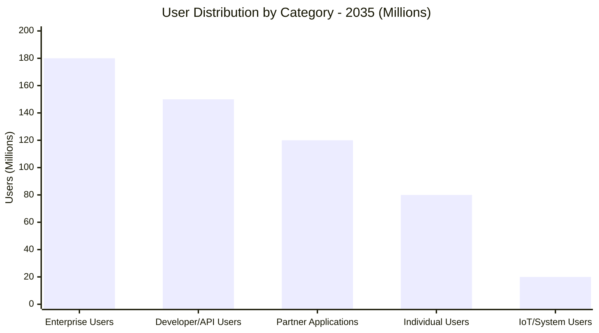

**User Growth Breakdown:**

| Year | Total Users (M) | Enterprise | Developers | Partners | Individual | IoT/Systems |
|------|----------------|------------|------------|----------|------------|-------------|
| 2025 | 1 | 0.3 | 0.3 | 0.2 | 0.1 | 0.1 |
| 2026 | 3 | 1.0 | 1.0 | 0.5 | 0.3 | 0.2 |
| 2027 | 8 | 2.5 | 2.5 | 1.5 | 1.0 | 0.5 |
| 2028 | 20 | 6.0 | 6.0 | 4.0 | 2.5 | 1.5 |
| 2029 | 40 | 12.0 | 12.0 | 8.0 | 5.0 | 3.0 |
| 2030 | 75 | 22.0 | 22.0 | 15.0 | 10.0 | 6.0 |
| 2031 | 130 | 38.0 | 38.0 | 26.0 | 18.0 | 10.0 |
| 2032 | 200 | 58.0 | 58.0 | 40.0 | 28.0 | 16.0 |
| 2033 | 290 | 84.0 | 84.0 | 58.0 | 42.0 | 22.0 |
| 2034 | 410 | 118.0 | 118.0 | 82.0 | 60.0 | 32.0 |
| 2035 | 550 | 180.0 | 150.0 | 120.0 | 80.0 | 20.0 |

---

## Request Volume Growth

### API Request Scaling

Request volume growth is driven by increasing automation, real-time applications, and API-first architectures.

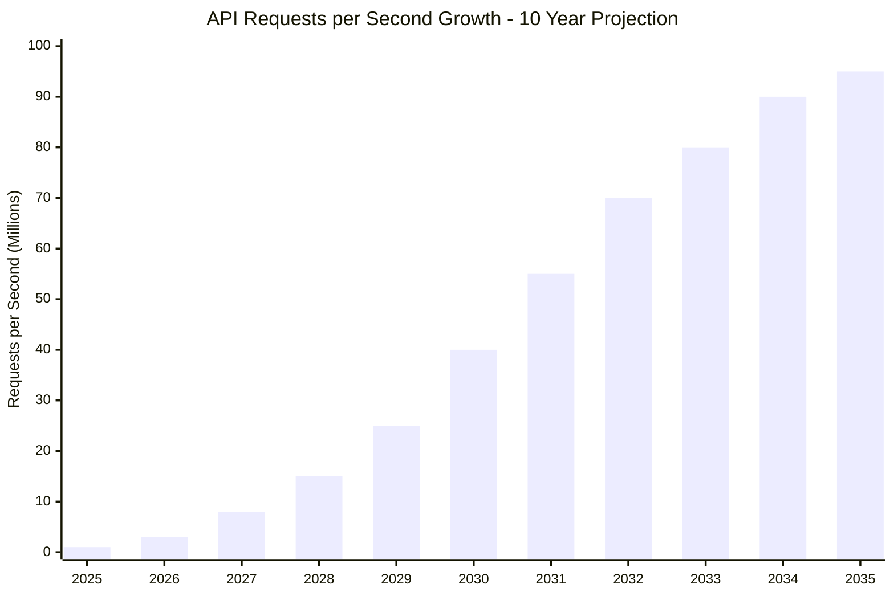

### Request Type Distribution

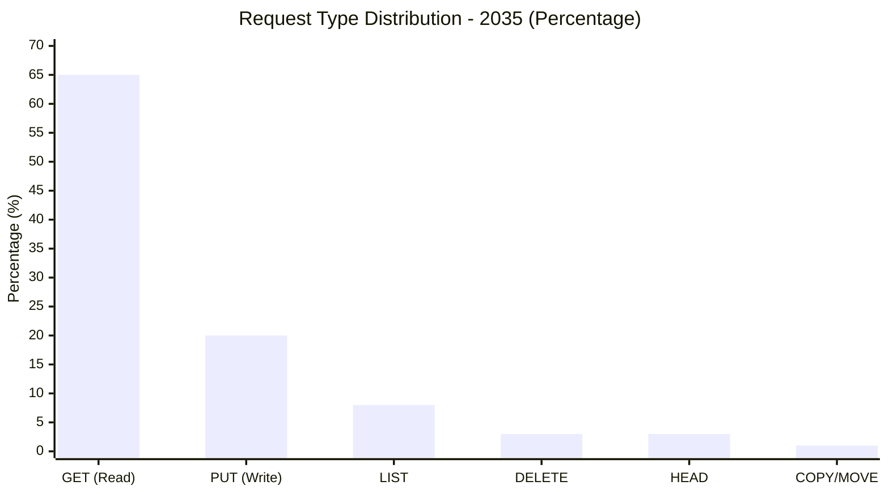

---

## Infrastructure Scaling Requirements

### Compute Resource Projections

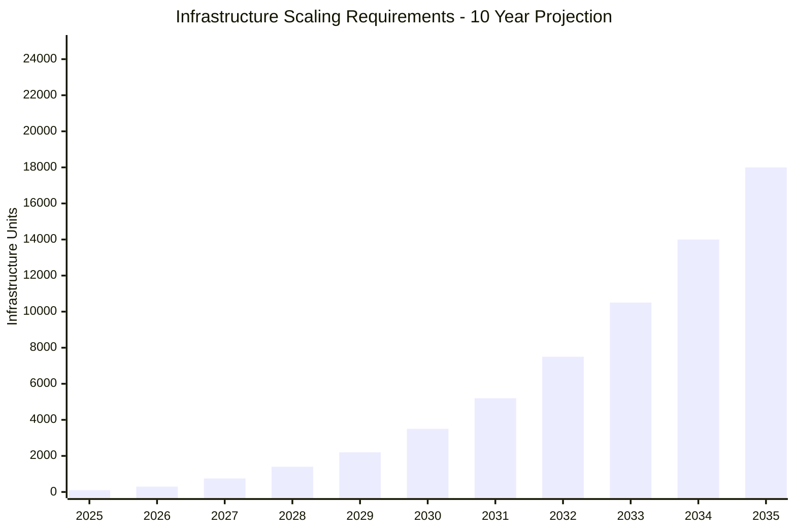

### Regional Distribution Growth

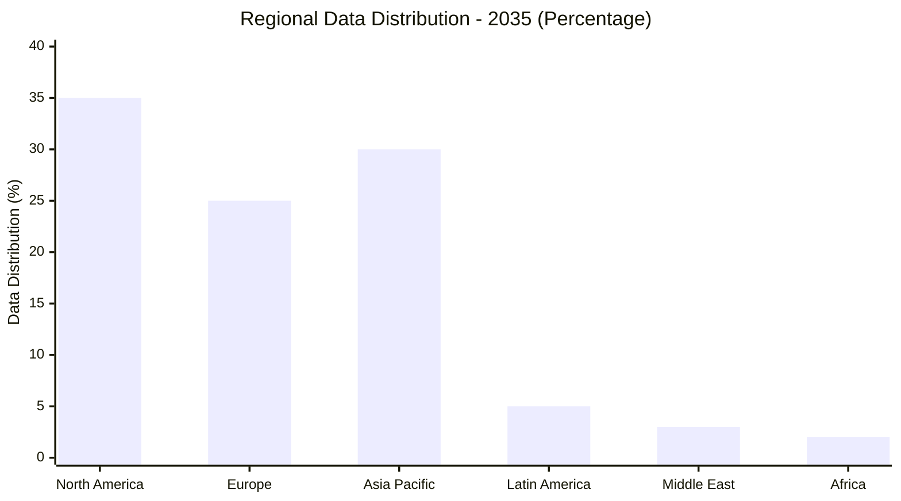

**Infrastructure Scaling Summary:**

| Component | 2025 | 2030 | 2035 | Growth Factor |
|-----------|------|------|------|---------------|
| Storage Nodes | 100 | 3,500 | 18,000 | 180x |
| API Gateway Instances | 20 | 500 | 2,000 | 100x |
| Metadata DB Clusters | 3 | 25 | 80 | 27x |
| Cache Clusters | 10 | 200 | 800 | 80x |
| Load Balancers | 5 | 50 | 200 | 40x |
| Regions | 2 | 8 | 15 | 7.5x |

---

## Cost Projections

### Total Cost of Ownership

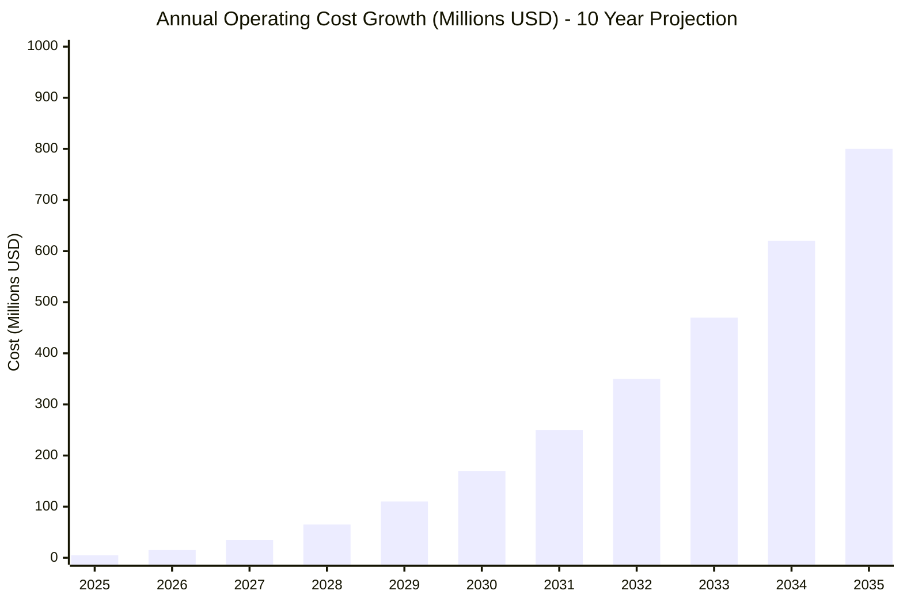

### Cost Breakdown by Category

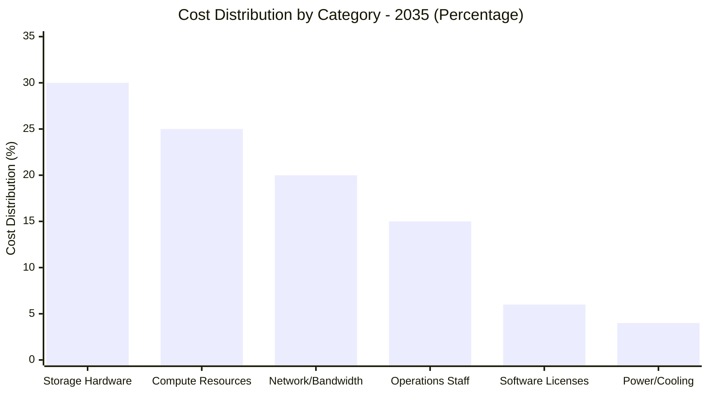

---

## Growth Assumptions and Risk Factors

### Key Assumptions

1. **Technology Evolution**: Assumes continued advancement in storage density and processing power
2. **Market Adoption**: Based on historical cloud adoption curves from AWS, Azure, and GCP
3. **Economic Stability**: Assumes stable economic conditions enabling continued IT investment
4. **Regulatory Environment**: Factors in increasing data sovereignty and privacy requirements
5. **Competition**: Accounts for competitive pressure driving feature innovation

### Risk Factors and Mitigation

| Risk Factor | Impact | Probability | Mitigation Strategy |
|-------------|--------|-------------|-------------------|
| Economic Recession | 20-30% growth reduction | Medium | Flexible pricing models, cost optimization |
| Technology Disruption | Market share loss | Low | Continuous innovation, platform evolution |
| Regulatory Changes | Compliance costs | High | Proactive compliance, multi-region strategy |
| Security Breaches | Trust and adoption impact | Medium | Best-in-class security, transparency |
| Competition | Pricing pressure | High | Differentiation through features and performance |

### Sensitivity Analysis

- **Conservative Scenario**: 50% of projected growth (economic headwinds)
- **Optimistic Scenario**: 150% of projected growth (breakthrough adoption)
- **Most Likely Scenario**: 100% of projected growth (baseline projections)

---

## Strategic Implications

### Capacity Planning Recommendations

1. **Preemptive Scaling**: Begin infrastructure expansion 6-12 months before projected demand
2. **Regional Strategy**: Prioritize expansion in Asia-Pacific and Europe for 2026-2028
3. **Technology Refresh**: Plan major architecture updates every 3-4 years
4. **Cost Optimization**: Implement tiered storage and lifecycle policies by 2027

### Investment Priorities

1. **Years 1-3 (2025-2027)**: Focus on core platform stability and regional expansion
2. **Years 4-6 (2028-2030)**: Invest in AI/ML capabilities and edge computing
3. **Years 7-10 (2031-2035)**: Advanced features, next-generation technologies

### Revenue Projections

Based on industry benchmarks and pricing models:

| Year | Revenue (M USD) | Revenue/TB/Month | Active Customers |
|------|----------------|------------------|------------------|
| 2025 | 2 | $20 | 100 |
| 2030 | 96 | $15 | 5,000 |
| 2035 | 600 | $12 | 25,000 |

---

## Conclusion

The distributed object store is projected to experience explosive growth over the next decade, following patterns established by major cloud storage providers. Key findings:

1. **Data Volume**: From 100 PB to 30,000 PB (300x growth)
2. **Object Count**: From 1 trillion to 500 trillion objects (500x growth)
3. **User Base**: From 1 million to 550 million users (550x growth)
4. **Infrastructure**: Requires 180x scaling of storage infrastructure

The growth trajectory reflects the continuing digital transformation, IoT expansion, and increasing reliance on cloud-native architectures. Success will depend on maintaining service quality while scaling efficiently and cost-effectively.

### Next Steps

1. **Immediate (2025)**: Establish monitoring and capacity planning processes
2. **Short-term (2026-2027)**: Begin regional expansion and technology modernization
3. **Medium-term (2028-2030)**: Implement advanced features and optimization
4. **Long-term (2031-2035)**: Focus on next-generation capabilities and market leadership

This growth estimation provides a roadmap for strategic planning, investment decisions, and technology evolution over the next decade.
